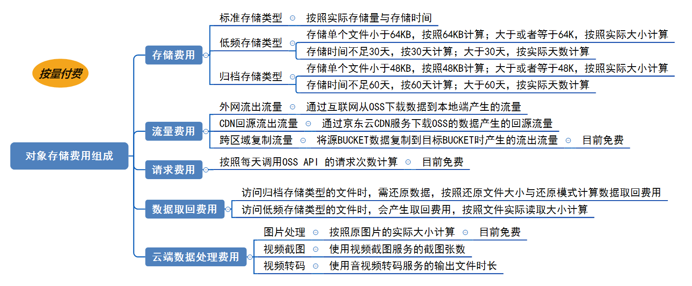

# 计费说明

本文主要介绍京东云对象存储 OSS 服务费用的各项组成部分及计费方式，您可以通过本文了解 OSS 服务费用收取详情。

* [计费方式](Billing-Rules#user-content-1)
* [费用组成](Billing-Rules#user-content-2)
    * [存储费用](Billing-Rules#user-content-3)
    * [流量费用](Billing-Rules#user-content-4)
    * [请求费用](Billing-Rules#user-content-5)
    * [数据取回费用](Billing-Rules#user-content-6)
    * [云端数据处理费用](Billing-Rules#user-content-7)

## 计费方式

京东云对象存储所有地域均采用按量后付费的计费模式，根据用户实际用量按天推送账单，每天按照账单收取前一天的费用。

**说明**：
标准存储类型为您在全地域提供了免费额度，请参见[免费额度](https://docs.jdcloud.com/cn/object-storage-service/free-tier-for-oss)。

## 费用组成

OSS 服务费用由存储费用、流量费用、请求费用、数据取回费用、云端处理费用几部分组成：

**说明**
OSS 的所有收费项目都是单独计费的，例如：您在 OSS 的存储空间内存放了 100GB 数据，每天将产生存储费用；若每天有通过外网访问您的数据，则您还会产生外网流出流量费用。

###  存储费用

OSS 服务提供多种存储类型：标准存储类型、归档存储类型、低冗余存储类型。详情请参见[存储类型介绍](../Introduction/StorageClass-Overview.md)。

存储费用根据实际存储容量收取，不同的存储类型，产生的存储费用说明如下：

**说明：** [产品定价](./Price-Overview.md)中，存储费用是以每 GB 每天为单位，结算存储费用。

|存储类型|计量项|计费方式|
|:---|:--|:---|
|标准存储|   存储量：按照实际的存储量计算。   存储时间：按实际存储时间计算。|每天结算一次存储空间内标准存储类型文件的存储费用。 存储费用： 每个地域存储量≤10：免费 （存储量（GB）-10（GB））\* 标准存储每天时单价。|
|归档存储|   存储量：   存储的单个文件小于 48KB，按照  48KB 计算。例如，存储了 10 个 30KB 的文件，计算存储量时计算为 10 个  48KB 的文件。    存储的单个文件大于或等于48KB，按照实际大小计算。   存储时间：    低于 60 天，按 60 天计算。   大于或等于 60 天，按照实际存储时间计算。|每天时结算一次存储空间内归档存储类型文件的存储费用。 存储费用：存储量（GB）\* 归档存储每小时单价。 **说明：** 上传或复制同名文件到 OSS 会导致 OSS 原有文件被删除，或者直接删除未满60天的归档存储类型文件，系统会在下次费用结算时加上剩余天数的存储费用，如：example（old）为归档存储类型文件，存储 10 天后被覆写为example（new）。系统会在下次费用结算时加上example（old）剩余 50 天的存储费用并正常计算 example（new）的存储费用。|
|低冗余存储| 存储量：按照实际的存储量计算。   存储时间：按实际存储时间计算。|每天结算一次存储空间内低冗余存储类型文件的存储费用。存储费用：存储量（GB）\*低冗余存储每天单价。|

### 流量费用 

流量指您使用的网络带宽流量累计值。具体计量项有：外网流出流量、内网流出流量、外网流入流量、内网流入流量、CDN 回源流出流量、跨区域复制流量。详细价格请参考[产品定价](./Price-Overview.md)。

|计量项|计量方式|计费方式|
|---|----|----|
|内网流入流量|通过京东云内网从云主机等内部服务上传数据到对象存储所产生的上行流量。|免费|
|内网流出流量|通过京东云内网从对象存储下载数据到云主机等内部服务所产生的下行流量。|免费|
|外网流入流量|通过公网从本地端上传数据到京东云对象存储所产生的上行流量。|免费|
|外网流出流量|通过公网从京东云对象存储下载数据到本地端所产生的下行流量。|流量费会按天为单位，累计计费。 每天累计外网流出流量（GB）\*每 GB 单价。例如，北京地域某存储空间（Bucket），当天已累计产生外网流出流量 100GB，所以外网流出流量费用为0.5\*100（GB）=50元|
|CDN 回源流出流量|通过CDN服务层下载 OSS 的数据所产生的回源下行流量。|每天累计 CDN 回源流出流量（GB）\*每 GB 单价|
|跨区域复制流量|使用跨区域复制功能将源 Bucket 的数据同步复制到目标 Bucket 时所产生的流出流量。|每天累计跨区域复制流量（GB） \* 每 GB 单价。|

## 请求次数费用

您所有对 OSS 的操作无论是通过控制台还是其他工具，最终都是对 OSS API 的调用。接口调用费即会用根据您调用 OSS API 接口的次数计费。写操作与读操作次数费用，详细价格请参考[产品定价](./Price-Overview.md)。

|计量项|计量方式|计费方式|
|---|----|----|
|调用 OSS API 接口次数|调用 OSS API 接口的请求次数。|每小时结算一次调用 OSS API 接口的费用。请求次数费用计算公式：每万次调用单价 \* 每小时实际调用次数/10000。**说明：** 该计费项暂时免费|

### 数据取回费用 

如果您访问了归档存储类型的文件，将会额外产生数据取回费用，该费用由取回模式和文件大小共同决定。详细价格请参考[产品定价](./Price-Overview.md)。

|存储类型|计量项|计费方式|
|----|---|----|
|归档存储|文件被访问前，需先还原，产生文件取回费用。|每小时结算一次数据取回费用：还原文件大小（GB）\*对应取回模式每 GB 的数据取回单价。|

### 云端数据处理费用 

如果您使用了OSS的视频转码与截图，图片处理功能，将会产生云端数据处理费用详细价格请参考[产品定价](./Price-Overview.md)。

|存储类型|计量项|计费方式|
|----|---|----|
|音视频转码时长|使用音视频转码服务的输出文件时长。|每天累计输出文件时长\* 每分钟转码单价。|
|视频截图张数|使用视频截图服务的截图张数。|每天累计截图张数/1000\* 每千张单价。|
|图片处理|OSS 按处理原文件的实际大小计算数据处理量。|图片文件大小 * 每 GB 的图片处理单价，目前免费|

