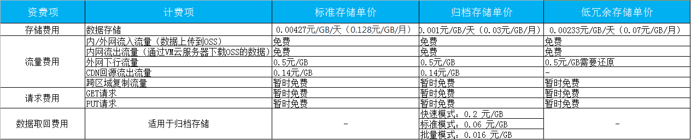
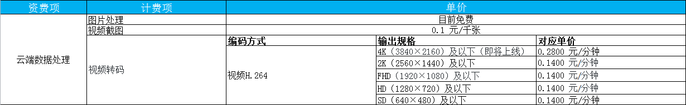

# 价格总览

京东云对象存储以天为计费周期，每天固定时间进行前一天的账单结算，计费周期内的相关收费标准如下所示：

## 对象存储价格概览

## 云端数据处理价格概览

说明：

- 转码费用 = 输出文件时长 x 转码单价
- 输出规格判定：按输出视频分辨率的长边和短边属于输出规格划定的范围进行判定，方式如下：以输出  HD (1280 x 720)及以下 规格为例，输出视频的分辨率长边不大于1280且短边不大于720则属于该输出规格。如输出视频的长边大于1280或输出视频的短边大于720，该输出视频属于更高输出规格。
- 若转码失败，失败时长不计入计费。
