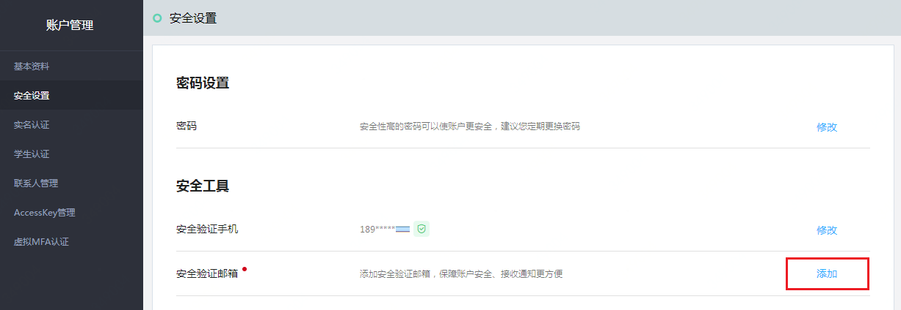
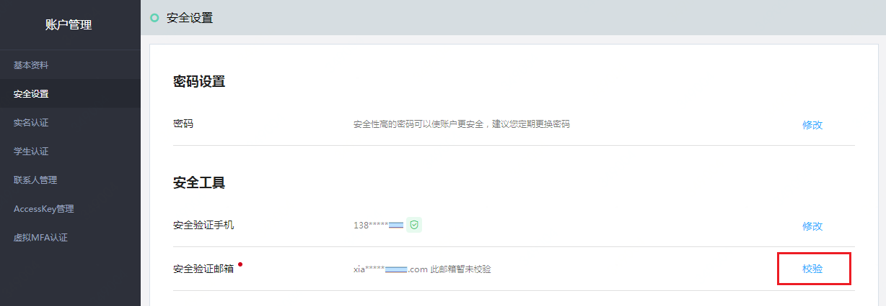
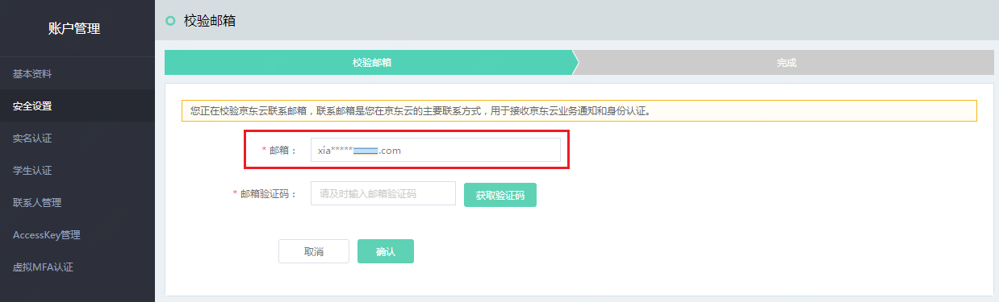
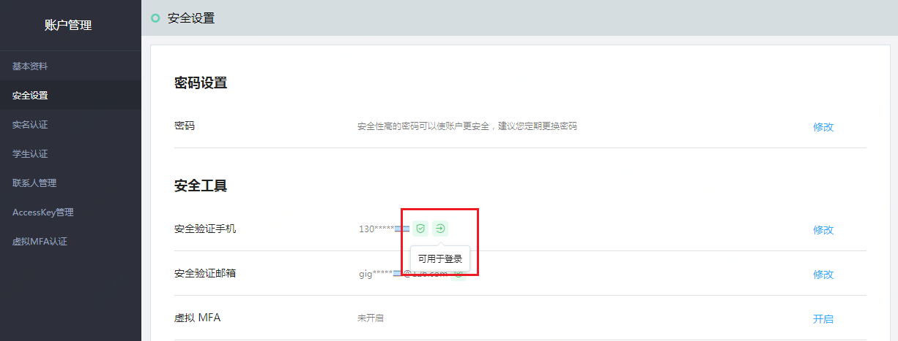
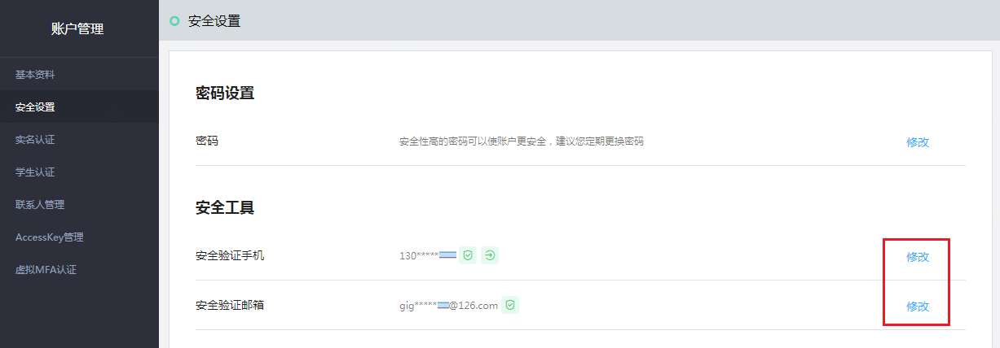
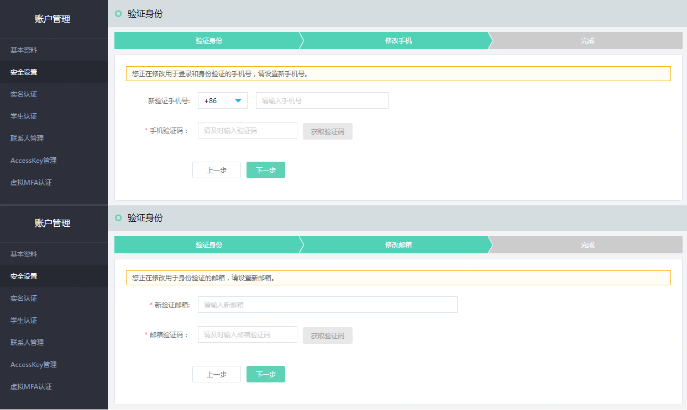
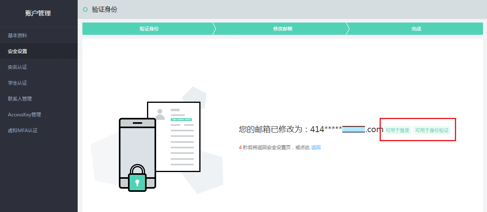

# 管理绑定手机或邮箱

（如果您使用的是京东账号，请参考 [《京东账号管理》](../../../documentation/User-Service/Account-Management/Manage-JD-Account.md) 进行操作。）

账号绑定的手机和邮箱是验证账号操作人身份的安全工具。当发生敏感或异常操作时，通过对手机或邮箱进行验证，可以保障账号安全。
手机和邮箱也是接收京东云重要通知的主要方式，如资源到期释放、监控告警等消息。同时，对于在京东云只有一个账号的用户，可以使用账号绑定的手机或邮箱进行登录。

## 首次绑定手机、邮箱

注册京东云账号时，需要填写一个有效的手机号，注册后账号即与该手机绑定。

注册成功后，京东云会引导您填写一个邮箱，如果当时未进行操作，后续可以在 “账户管理-安全设置” 页面绑定邮箱，如图一。填写邮箱后，京东云会发送验证邮件，验证完成后账号即与该邮箱绑定，未验证时该邮箱处于 “未校验” 状态，不能用于身份验证和接收消息，如图二--图三。

图一：在安全设置页面添加邮箱

图二：未校验的邮箱不能用于身份验证和接收消息

图三：对邮箱进行校验，或更改一个邮箱

## 查看绑定手机、邮箱

在 “账户管理-安全设置” 页面可以查看账号绑定的手机和邮箱，以及该账号是否能通过手机、邮箱进行登录，如图四。

图标  代表该手机或该邮箱能用于身份验证（未校验的邮箱不能用于身份验证）；
图标  代表该手机或该邮箱能用于登录

图四：查看手机、邮箱是否能用于登录

## 修改绑定手机、邮箱

如果账号管理人员手机换号，或发生人员变动，需要及时更新账号的绑定手机或邮箱，如图五--图八。

图五：点击修改手机或邮箱（如需修改未校验的邮箱，直接点击 “校验” 即可，如图三）

图六：验证操作人身份，选择可用的验证方式（如果手机不可用，请通过工单或电话 400-615-1212 联系客服协助修改手机）

图七：修改手机或邮箱，修改之后，可能会使账号的登录方式发生变化

图八：完成修改，查看修改后是否能用手机或邮箱登录。只有当手机或邮箱未关联过任何账号时，才能用于登录；否则仅能用于安全验证

