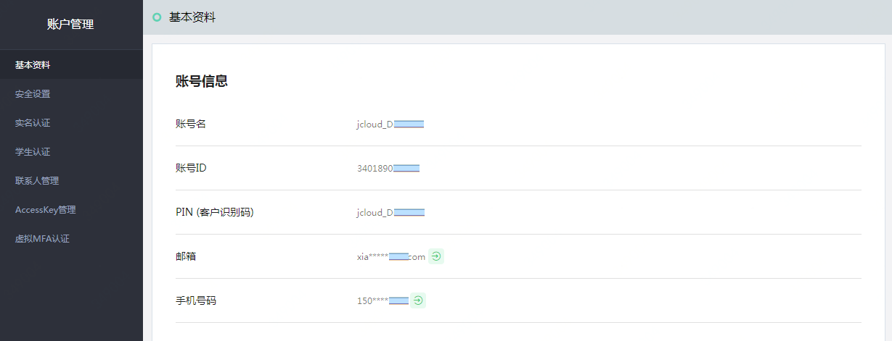

# 查看账号信息

（如果您使用的是京东账号，请参考[《京东账号管理》](../../../documentation/User-Service/Account-Management/Manage-JD-Account.md) 进行操作。）

登录京东云后，可以通过 “账户管理 - 基本资料” 页面查看账号信息：
- 账号名：注册或京东账号升级时由用户设置，用于登录。账号名不支持修改
- 账号ID：账号标识，用于 IAM 授权（参考 [IAM 帮助文档](https://docs.jdcloud.com/iam)）。账号ID不支持修改
- PIN (客户识别码)：账号的系统标识，一些 OpenAPI 中可能会要求传递 pin 参数（例如 [shareImage](https://docs.jdcloud.com/virtual-machines/api/shareimage?content=API)）。PIN不支持修改
- 邮箱/手机号码：如果账号绑定的邮箱（或手机）能用于登录，则会在 “基本资料” 页面显示，且带有 
 图标；如果邮箱（或手机）不能用于登录，则该页面不显示。修改邮箱（或手机），请前往 “安全设置” 页面（参考[《管理绑定手机或邮箱》](../../../documentation/User-Service/Account-Management/Change-JDCloud-Phone-Number.md)）

