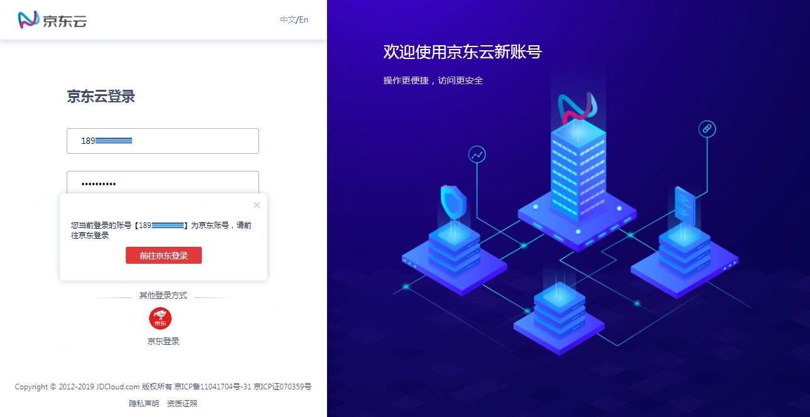
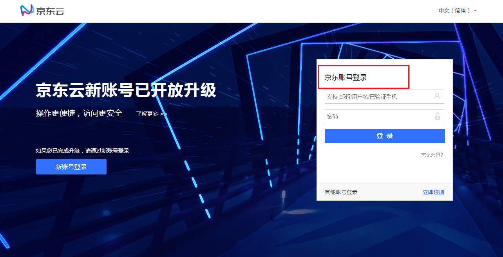
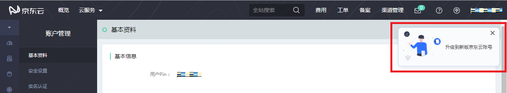

# 京东账号管理

## 京东账号登录

如果您是2019年7月18日前开通京东云业务、且未进行过账号升级的老用户，则您的账号属于京东账号，需要通过 “京东登录” 访问京东云，如图一--图二。

图一：京东账号用户，请通过京东登录访问

图二：京东账号登录

## 修改登录手机、邮箱、密码

京东账号的登录手机、登录邮箱、登录密码，请在京东商城修改。

## 查看账号信息

在京东云 “账户管理 - 基本资料” 页面可以查看京东账号的用户名（即 pin）。

## 修改京东云联系手机

京东账号在开通京东云业务时，需要提供一个手机号用于接收京东云通知、校验在京东云的敏感操作，该手机可能与您的京东账号登录手机不同。
您可以在 “账户管理 - 安全设置” 中查看和修改联系手机。修改后的手机号不会向您的京东账号同步。

## 京东账号升级为京东云账号

您可以始终使用京东账号访问京东云，但是不能使用部分京东云的账号服务。建议您将账号升级为京东云账号，升级的入口在 “账户管理 - 基本资料” 页面，如图三。

京东云账号的更多介绍，请参考[《京东云新账号简介》](https://docs.jdcloud.com/cn/account-management/what-is-jdcloud-account)。

图三：账号升级入口

