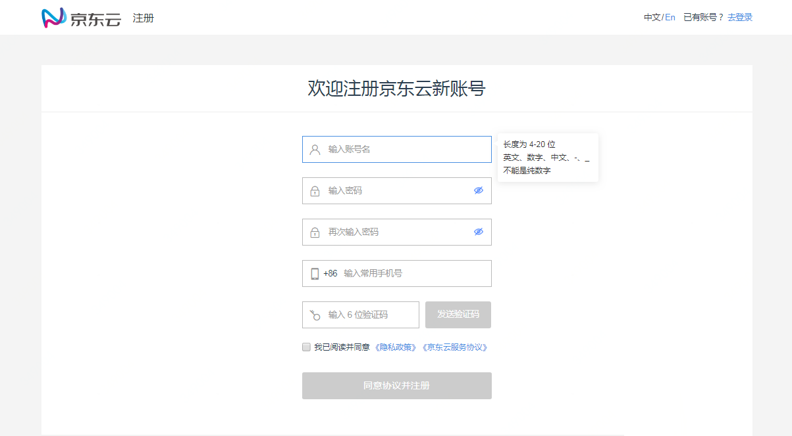
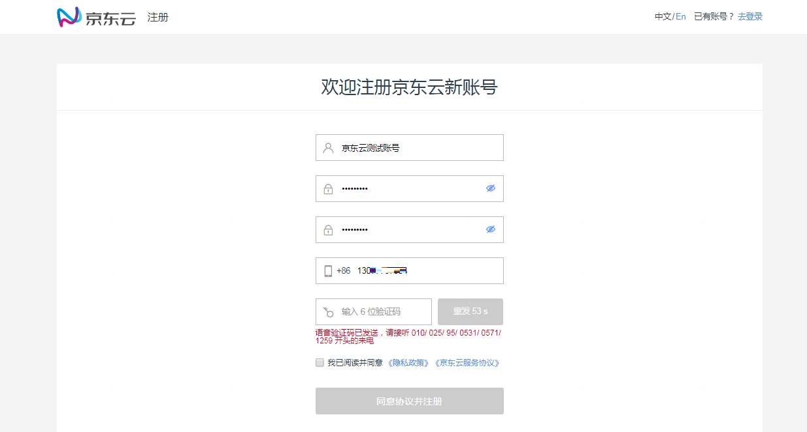
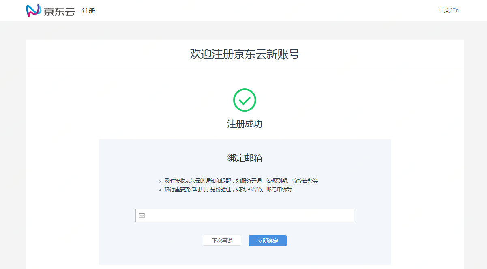
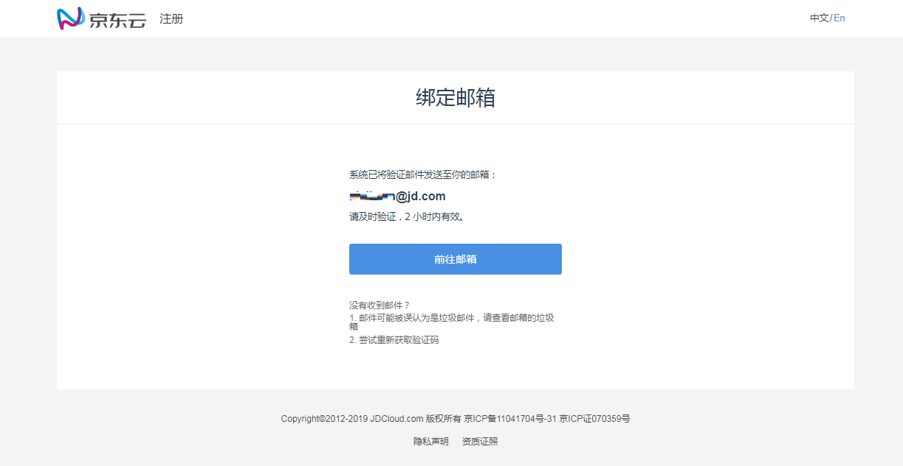
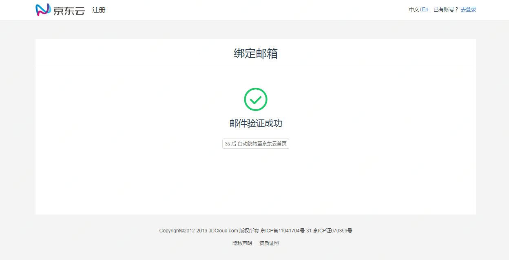
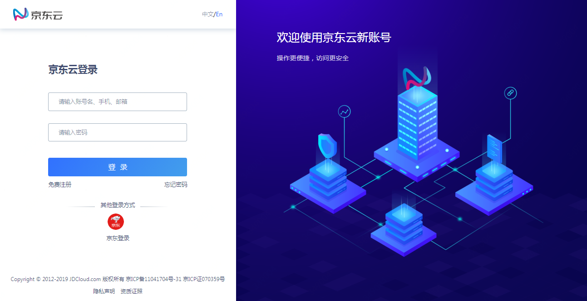
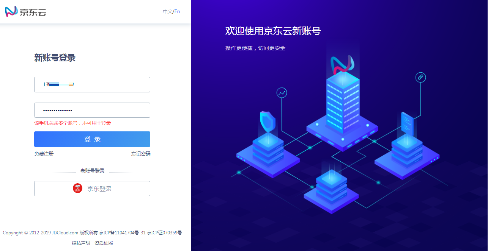
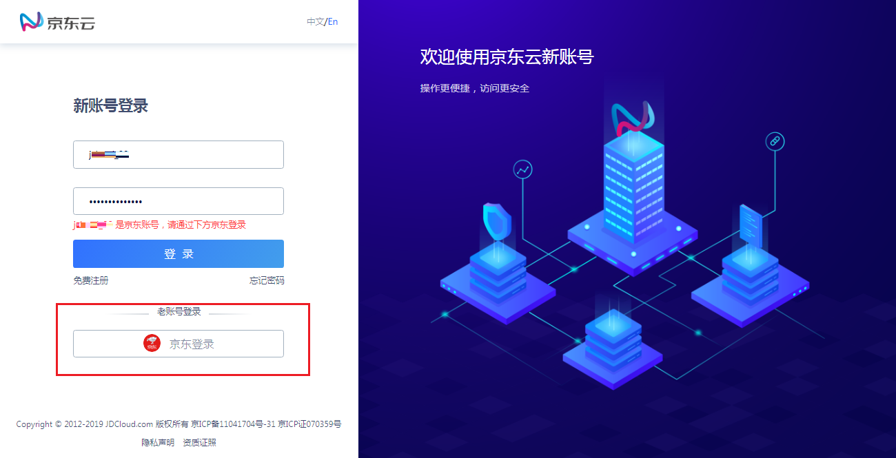

# 登录与注册
## 注册账号
京东云注册的账号不能登录京东商城。目前京东云仅支持大陆手机注册，步骤如下：

### 1、输入账号名和密码
账号名是京东云账号的标识，用于登录。输入时，页面会提示输入规则：
账号名长度为4-20位，支持输入汉字、英文字母、数字或“-”、“_”符号，不支持纯数字格式的账号名；
登录密码长度为7-20位，密码中必须包含英文字母、数字和符号（支持除空格外的英文符号），且密码不能与账号名相同。

### 2、输入一个常用手机号，作为账号的安全手机
请使用您的常用手机进行验证。验证码可能会通过短信或来电的方式发送。如果使用手机小号进行注册，由于小号本身的网络不稳，可能会出现偶尔收不到短信或来电的问题，请等待一段时间后进行重试。

注册成功后，该手机会成为账号绑定的安全手机，用于接收京东云的重要通知，并作为您账户的安全验证方式。
如果您的手机号是首次用于开通京东云业务，则该手机可以用于账号登录；如果手机号已关联其他京东云账号，则您当前注册的账号不能使用手机号进行登录。

### 3、补充安全邮箱
注册完成，会引导进行邮箱绑定，这一步可以跳过。邮箱是京东云联系用户的主要方式之一，为了不要漏收京东云资源和服务变动信息、监控告警、账户信息，建议填写并验证邮箱。

填写后，京东云会给邮箱发送一个验证邮件。请尽快前往邮箱点击验证链接，对邮箱进行验证，验证链接有效期为 2 个小时。如果您的邮箱是首次用于开通京东云业务，则验证成功后邮箱可用于账号登录；如果邮箱已关联其他京东云账号，则邮箱仅可用于身份验证和消息接收，不能使用邮箱登录当前注册的账号。

## 登录账号

### 1、京东云登录
京东云支持通过账号名和密码登录。对于部分用户，如果手机或邮箱在京东云关联的账号是唯一的，也可以通过手机或邮箱加密码登录。

2019年7月18日前注册的账号，属于京东账号，如果未进行账号升级，请通过 “京东登录” 进行访问。

如果使用手机或邮箱进行登录时，提示 “当前手机/邮箱不可用于登录”，说明输入的手机/邮箱在京东云关联了多个账号，或关联的账号不支持用手机/邮箱进行登录，此时请尝试使用账号名加密码登录。如果您确认曾经使用该手机/邮箱在京东云登录成功，您的账号可能属于原京东账号，请尝试通过 “京东登录” 进行访问。

### 2. 通过京东登录
如果您是2019年7月18日前开通的京东云服务，且未进行过账号升级，则可以通过 “京东登录”。

京东登录规则与京东商城相同，如果在京东登录过程中遇到问题，请参考[《京东云新账号简介》](https://docs.jdcloud.com/cn/account-management/what-is-jdcloud-account)或联系客服（400-615-1212）进行账号升级。升级后即可直接使用京东云登录。
