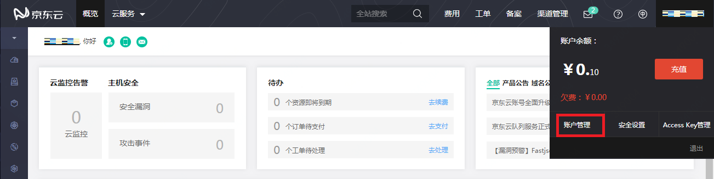
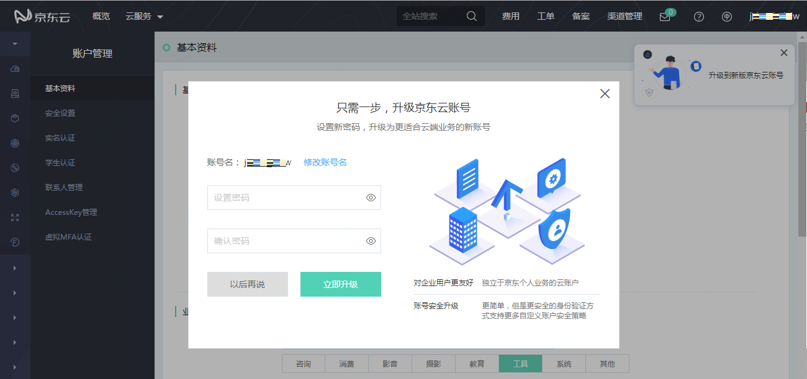
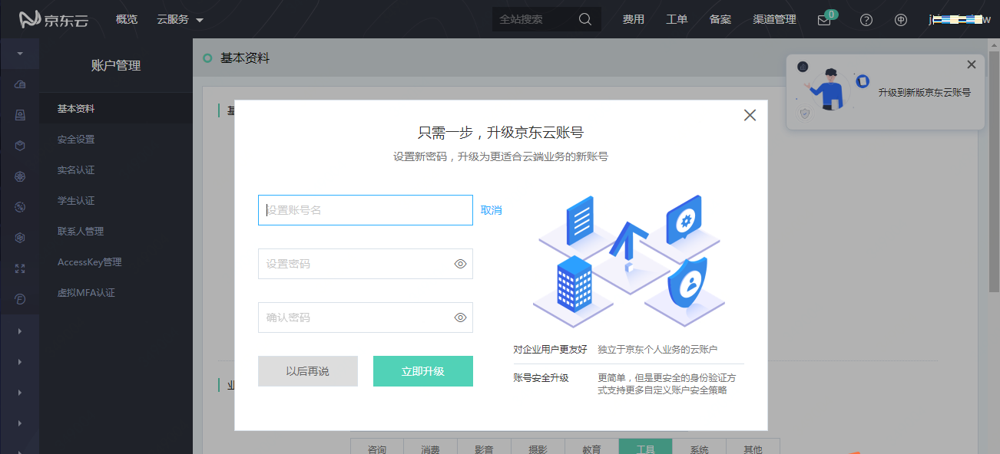

# 京东云新账号简介

京东云账号是一套全新的账号系统。您可以继续通过京东账号访问京东云，但新的京东云账号更适应云上用户的使用习惯。

### 京东云账号的新特性

**对企业用户更友好**

* 独立于京东商城个人业务的云账户，不受京东登录规则限制
* 新注册的京东云账号，与京东商城完全隔离
* 原京东账号升级后，用户默认使用新设置的京东云账号和密码登录，但也支持继续使用京东账号登录（如果您需要关闭京东登录访问，请通过工单申请）

**升级了账号安全策略**

* 账号密码和验证方式管理更新
* 支持用户定义登录安全策略，例如限制办公外网对云资源的访问

### 如何升级到京东云新账号

进入京东云 “账户管理-基本资料” 页面，点击 “升级到新版京东云账号”，可以打开升级窗口。

在升级窗口中，为京东云账号设置登录密码，然后点击 “立即升级”，即可完成账号升级。

升级窗口中的 “账号名” 即为您的新账号。“账号名” 默认与您原来的京东账号相同，如果需要更换，请点击 “修改账号名”。

升级成功后，您即可使用新设置的账号名和密码登录京东云。

### 常见问题

1. 账号升级后，账户下的已购资源会受影响吗？
  答：不会受影响。除了登录和账户的安全设置以外的功能，包括但不限于账户内的资源、服务和数据等，都不会发生变化。

2. 升级后如何登录京东云？
  答：点击登录页左侧的 “新账号登录” 按钮，可以进入新账号登录页面。通过京东云客服进行升级后，请确认您的登录账号，并在首次登录新账号时，通过 “忘记密码” 流程设置新账号的登录密码。

3. 我不想进行升级，对我有什么影响？
  答：任何用户都可以继续使用当前的账号，而不进行升级。

4. 我在京东云官网页面注册的账号，是京东账号还是京东云新账号？
  答：2019年7月18日前，在京东云官网页面注册的账号都是京东账号，可以通过升级成为京东云新账号；从2019年7月18日起，新注册的账号均为京东云新账号，与京东账号不再关联，不能登录京东商城。
