# 全局设置

## 1.转码设置

京东云视频点播产品提供“京享超清”和“极速转码”两种转码方式，客户可根据自身业务需求在模板设置中创建不同的模板类型使用，在转码同时还提供“舒适音频”功能，带来更好的视听感受，详细介绍参考下面文档。

**京享超清：** 京享超清转码是基于京东云独特的“智清Vedio”编转码技术，对视频中的内容、场景、画面进行智能分析和处理，让视频拥有高画质的同时，可以降低视频码率，有效的为客户节约使用带宽和成本，适用于大部分业务场景。

**极速转码：** 极速转码是基于京东云自研的“粒子转码”技术，支持倍数转码加速，极大的降低转码需要的时间，满足客户视频内容快速生产快速发布的需求，适用于有大量视频源需要处理，对转码速度有较高要求，需要快速发布，画质要求低的业务场景。

**舒适音频：** 舒适音频是基于京东云独特的“智享Audio”音频分析处理技术，对音频音量水平进行分析，自动实现音频的自动增益和动态范围调整，
让不同场景的节目音量过度更加平滑，给客户带来更加舒适的视听享受。

|转码方式  |附加功能|适用场景|
|-|-|-|
|京享超清|可叠加水印、舒适音频|画质增强同时降低视频码率，适用大部分视频处理场景，|
|极速转码|可叠加舒适音频、不能叠加水印|倍数转码，适用于对画质不敏感，转码速度要求高，快速转码的视频处理场景|

### 1.1 模板设置 ###

登录京东云控制台，在左侧“视频服务”产品分类中点击“视频点播”产品，选择“全局配置”菜单，点击“转码设置”子菜单，就可以进入转码模板管理页面。

### 1.2 京享超清模板 ###

在模板管理中，客户可选择“京享超清”标签页来管理对应的模板，京享超清转码模板分两种类型“预设模板”和“自定义模板”，预设模板中包含了常见的几种分辨率目标格式，如果预设模板无法满足业务需求，可以通过“添加转码模板”按钮创建自定义模板，根据实际需求设置转码参数，同时可在模板列表中对模板进行编辑、删除等管理。

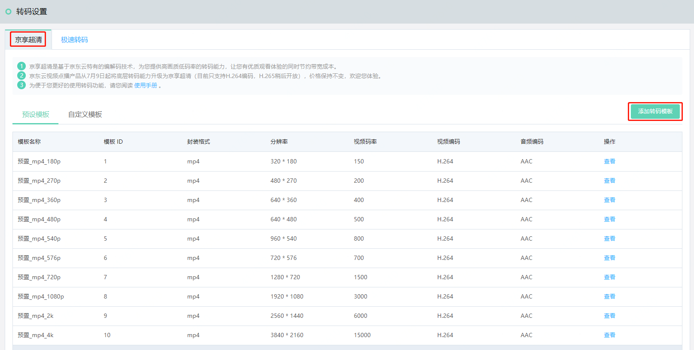

### 1.3 极速转码模板 ###

在模板管理中，客户可选择“极速转码”标签页来管理对应的模板，可以通过“添加转码模板”按钮创建自定义模板，根据实际需求设置转码参数，同时可在模板列表中对模板进行编辑、删除等管理。

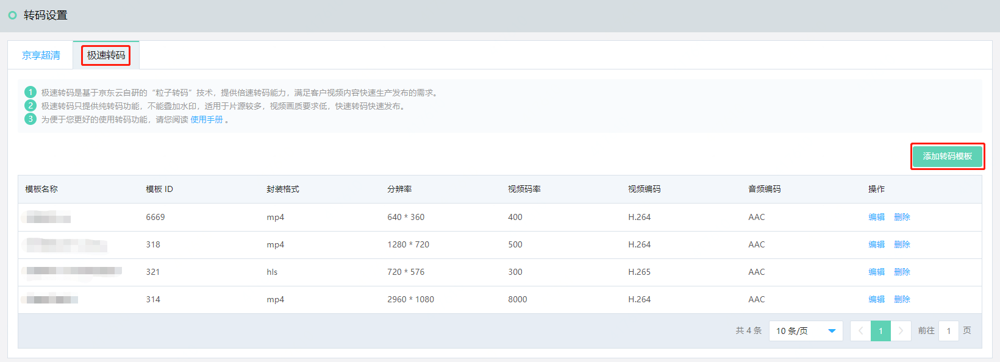

### 1.4 转码模板参数设置 ###

在添加“京享超清”或“极速转码”模板时，可根据自己的需求设置转码的目标参数，其中包括“基础信息”、“视频参数”、“音频参数”三个部分，可对模板名称、视频编码格式、视频码率、音频码率等参数进行设置，在音频参数中京东云视频点播产品提供“舒适音频”增强功能，在开启后可对音频做自动分析和动态调整，让不同视频节目的音质过渡更加平滑，带来更好的视听感受。

**视频参数设置**

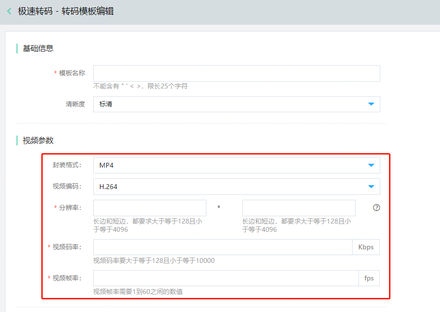

**注意，视频分辨率宽高比支持按源视频比例自动缩放，缩放规则如下：**

1.宽和高都为空，则分辨率和原视频保持一致

2.如果宽为空，高不为空，宽按视频原始比例进行缩放

3.如果宽不为空，高为空，高按视频原始比例进行缩放

4.宽和高都不为空，则根据宽和高数值来处理

**音频参数设置**

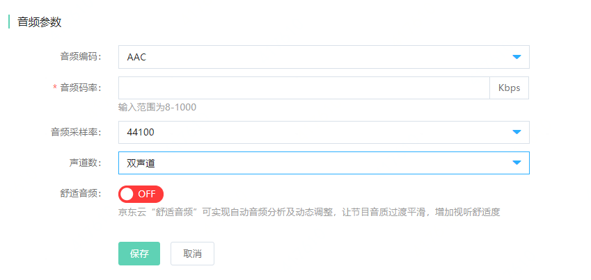

**舒适音频设置**

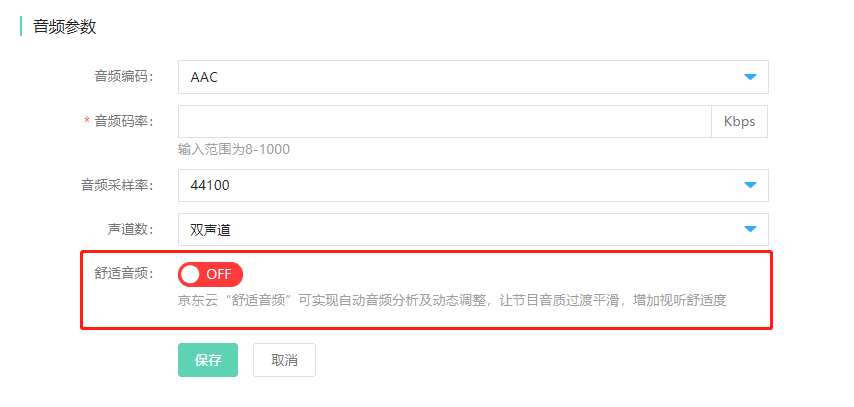

### 1.5 常见转码参数推荐 ###

|清晰度|推荐码率|推荐分辨率|分辨率范围|
|-|-|-|-|
|标清|400Kbps|640x360|128x128~640x360|
|高清|1500Kbps|1280x720|641x361~1280x720|
|超清|3000Kbps|1920x1080|1281x721~1920x1080|
|2K|3500Kbps|2560x1440|1921x1081~2560x1440|
|4K|6000Kbps|3840x2160|2561x1441~3840x2160|

## 2.水印设置
登录视频点播控制台，点击左侧菜单栏“视频点播”-“全局配置”-“水印设置”，进入“水印设置”，可以点击“添加水印模板”，添加新的水印模板。对于已有的水印模板，可在模板列表中点击“编辑”，进入模板编辑页面，修改模板中的水印参数。

水印的宽和高以及水印的偏移，同时支持像素和百分比两种单位的设置。

**水印大小**

|配置单位|说明|
|-|-|
|像素|设置水印图片的实际像素大小，取值范围 [8,4096]|
|百分比|水印和实际画面的占比比例，取值范围（0,100）|

**水印偏移**

|配置单位|说明|
|-|-|
|像素|根据选择的初始位置，设置按像素进行偏移，取值范围 [8-4096]|
|百分比|根据选择的初始位置，设置按对应的比例进行偏移，取值范围（0,100）|

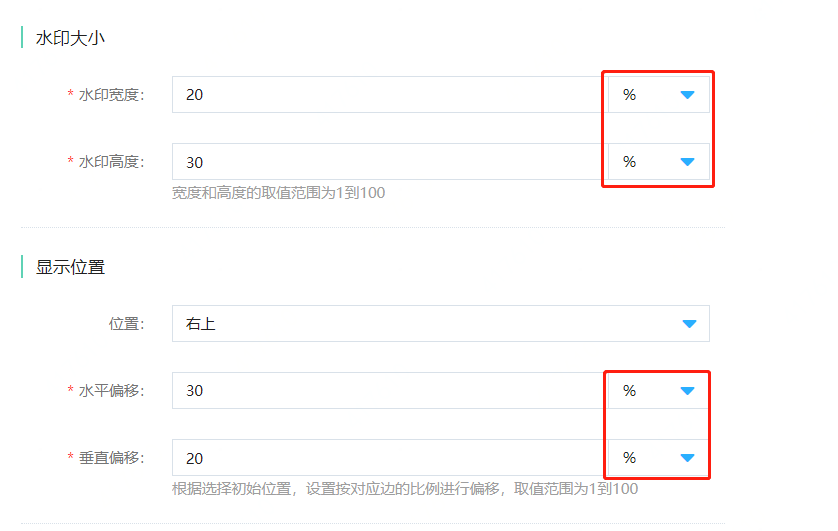

## 3.分类设置
登录视频点播控制台，点击左侧菜单栏“视频点播”-“全局配置”-“分类设置”，进入分类配置页面，可以增加分类、添加子分类。

## 4.域名设置
### 4.1 域名添加
京东云默认为客户提供一个默认域名，如果需要修改，您可以通过域名设置，添加您经过备案的域名并设为默认，还可以进行启用、停用、删除等操作。启用中的域名首先需要停用才可删除，否则不能删除。

在添加了自定义域名后，客户需要到购买域名的服务商处做cname绑定操作，才能正常解析使用域名，具体操作步骤请参考各个域名服务商操作指南。
   
### 4.2 访问控制

点播产品支持对播放域名安全相关的配置，在域名设置界面，点击想要配置的域名，会进入域名“访问设置”页面。

**A.Referer防盗链**

通过配置访问的referer黑白名单来对访问者身份进行识别和过滤，从而限制资源被访问的情况，点击Referer防盗链后面的修改配置选项，在弹出的窗口中进行规则配置。

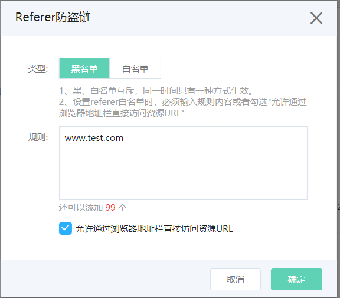

**B.URL鉴权**

高级防盗链功能，通过设置鉴权KEY对URL进行加密，充分保护源站资源，点击URL鉴权后面的修改配置选项，在弹出的对话框中根据需要进行配置，其中鉴权详细说明可参考4.3中内容，另外开启鉴权功能后需要注意以下两点：

1.在开启key防盗链后，原始URL将无法用于播放，请根据4.3章节中内容详细介绍，生成带鉴权的URL进行播放

2.开启URL鉴权后，hls格式暂时在控制台无法预览播放

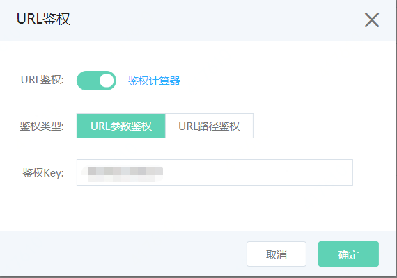
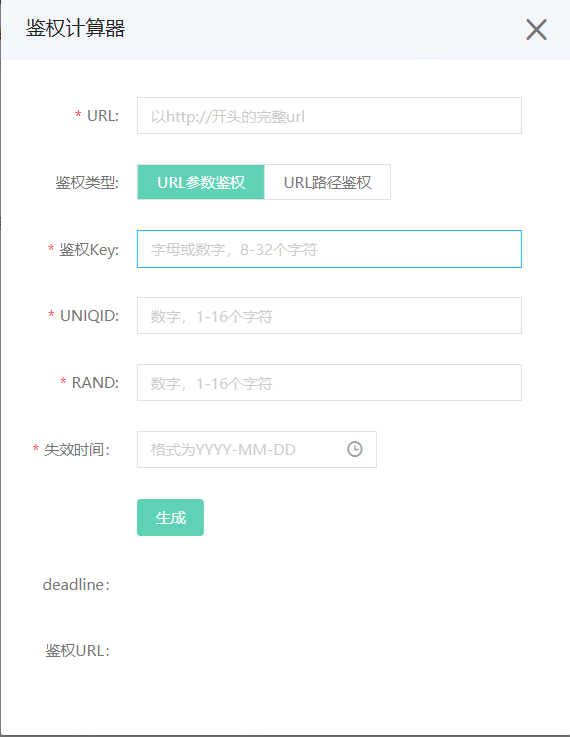

**C.IP黑名单**

通过黑名单来对访问者身份进行识别和过滤，添加到黑名单的IP，将无法访问当前加速域名。

### 4.3 URL鉴权说明

URL鉴权支持参数和路径两种鉴权方式，用户可以根据自己的业务情况，选择合适的鉴权方式，来实现对源站资源的有效保护。

**A.参数鉴权方法**

1 加密 URL 构成

http://DomainName/Path/Filename?参数&auth_token=expire-uniqid-rand-signature

signature =md5sum("uri-expire-uniqid-rand-private_key")

2 鉴权字段描述

|字段|描述|
|-|-|
|expire|失效时间，10位整型整数|
|uniqid|整型，随机数，唯一id，不使用时设置成0即可。该字段可以用来标记身份或业务，用户可自行设定|
|rand|整型，随机数，一般设置成0，可以使用生成token时的时间戳作为rand|
|signature|字符串，通过md5算法计算出的验证串，数字和小写英文字母混合0-9a-z，固定长度32，不区分大小写|
|uri|是用户的请求对象相对地址，不包含参数|
|private_key|用户自定义的秘钥（8-32个字符）|

3 原理说明

CDN服务器拿到请求后，首先会判断请求中的 expire 是否小于当前时间，如果小于，则认为过期失效并返回HTTP 403错误。如果 expire 大于当前时间，则构造出一个同样的字符串(参考以下signature构造方式)。然后使用MD5算法算出 new_signature ，再和请求中带来的 signature 进行比对。比对结果一致，则认为鉴权通过，返回文件。否则鉴权失败，返回HTTP 403错误。

new_signature 是通过以下字符串计算出来的：

origin_signature = "uri-expire-uniqid-rand-private_key "（uri是用户的请求对象相对地址，不包含参数）

new_signature = md5sum(origin_ signature)

4 示例说明

通过请求对象:
http://cdn.example.com/video/standard/1K.html?fa=121&jd=121

密钥设为：jdcloud1234 (由用户自行设置)

鉴权配置文件失效日期为：2020年06月18日00:00:00,计算出来的秒数为1592409600

则CDN服务器会构造一个用于计算signature的签名字符

/video/standard/1K.html-1592409600-0-0-jdcloud1234

CDN服务器会根据该签名字符串计算signature:
signature = md5sum("/video/standard/1K.html-1592409600-0-0-jdcloud1234") =06d97bc9e43ded48d991994006cfa127

则请求时url为：
http://cdn.example.com/video/standard/1K.html ?fa=121&jd=121&auth_token=1592409600-0-0-06d97bc9e43ded48d991994006cfa127

计算出来的 signature 与用户请求中带的 signature =06d97bc9e43ded48d991994006cfa127值一致，于是鉴权通过。

**B.路径鉴权法**

1 加密 URL 构成

http://DomainName/deadline/ md5sum("uri-deadline-password")/Path/Filename?参数

2 鉴权字段描述

|字段|描述|
|-|-|
|deadline|失效时间，10位整型整数|
|uri|是用户的请求对象相对地址，不包含参数|
|password|用户自定义的秘钥（8-32个字符|
|md5hash|通过md5算法计算出的验证串，数字和小写英文字母混合0-9a-z，固定长度32，不区分大小写|

3 原理说明

CDN服务器拿到请求后，首先会判断请求中的 deadline 是否小于当前时间，如果小于，则认为过期失效并返回HTTP 403错误。如果 deadline大于当前时间，则构造出一个同样的字符串(参考以下sstring构造方式)。然后使用MD5算法算出 HashValue ，再和请求中带来的 md5hash 进行比对。比对结果一致，则认为鉴权通过，返回文件。否则鉴权失败，返回HTTP 403错误。

HashValue 是通过以下字符串计算出来的：

sstring = "uri-deadline-Password" （uri是用户的请求对象相对地址，不包含参数）

HashValue = md5sum(sstring)

4 示例说明

通过请求对象:
http://cdn.example.com/video/standard/1K.html ?fa=121&cc=121

密钥设为：jcloud1234 (由用户自行设置)

鉴权配置文件失效日期为：2020年06月18日00:00:00,计算出来的秒数为1592409600

则CDN服务器会构造一个用于计算Hashvalue的签名字符

/video/standard/1K.html-1592409600-jcloud1234"

CDN服务器会根据该签名字符串计算HashValue:
HashValue = md5sum("/video/standard/1K.html-1592409600-jcloud1234") = 8afb0900782e14c35214ccda534a3679

则请求时url为：
http://cdn.example.com/1592409600/8afb0900782e14c35214ccda534a3679/video/standard/1K.html? fa=121&cc=121

计算出来的HashValue与用户请求中带的 md5hash = 8afb0900782e14c35214ccda534a3679 值一致，于是鉴权通过。

### 4.3 高级设置

在域名设置界面，点击想要配置的域名，进入域名配置的详细页面，选择高级页面，可看到域名的相关高级设置。目前支持HTTP Header参数设置。

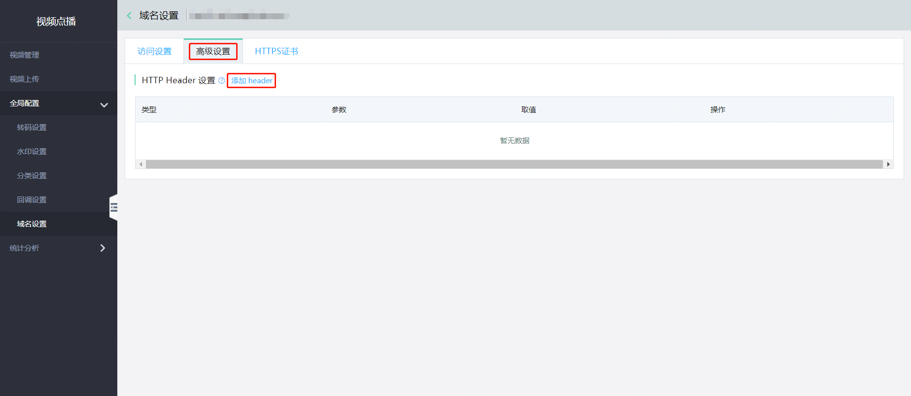

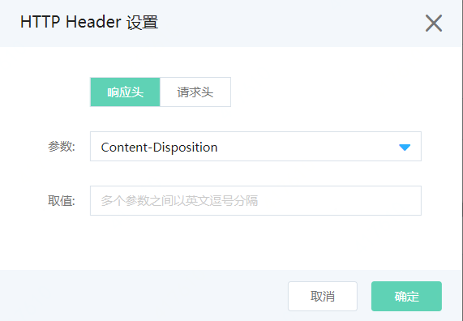

### 4.4 HTTPS证书设置

同样在域名设置界面，点击想要配置的域名，进入域名配置的详细页面，点击HTTPS证书配置页，可对当前域名添加HTTPS证书并对跳转规则做设置。

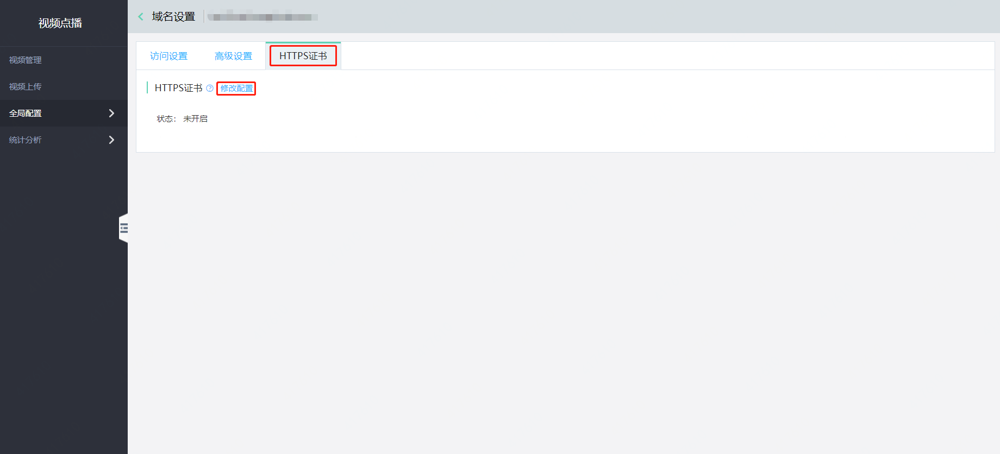

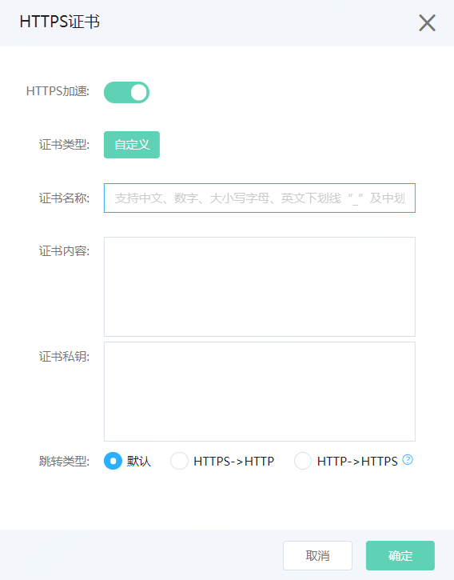

跳转类型说明：

默认表示：客户端协议是HTTP，则到CDN节点的请求协议为HTTP，HTTPS同理。

HTTPS -> HTTP表示：客户端协议是HTTPS，则到CDN节点的请求协议为HTTP。

HTTP -> HTTPS表示：客户端协议是HTTP，则到CDN节点的请求协议为HTTPS。

## 5.回调设置
视频点播支持任务完成的消息订阅。客户如需获取视频上传完成、转码完成的消息通知，可在回调设置中设置回调URL及回调事件，相关事件会通过客户填写的URL及时通知到客户。

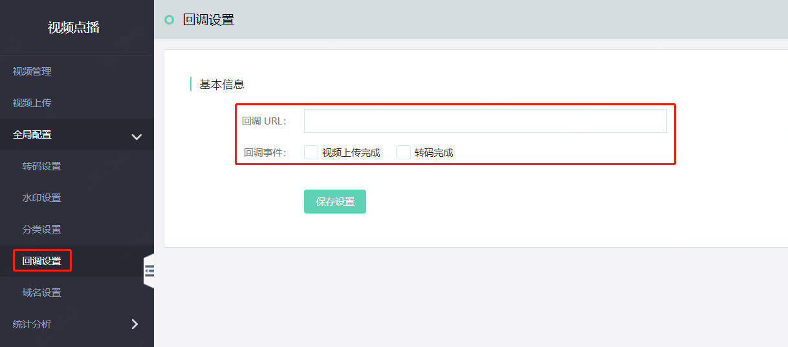

## 6.质量检测设置

**质量检测：** 质量检测是基于京东云自研的视频画面审核技术，可对视频画面质量进行各种独立指标检测，准确识别视频文件中的静帧、偏色、黑场等问题，可做到画面质量预发现，降低人工审核成本，提高整体业务及视频生产的质量和效率。

登录京东云控制台，在左侧“视频服务”产品分类中点击“视频点播”产品，选择“全局配置”菜单，点击“质量检测”子菜单，就可以进入质量检测模板管理页面。

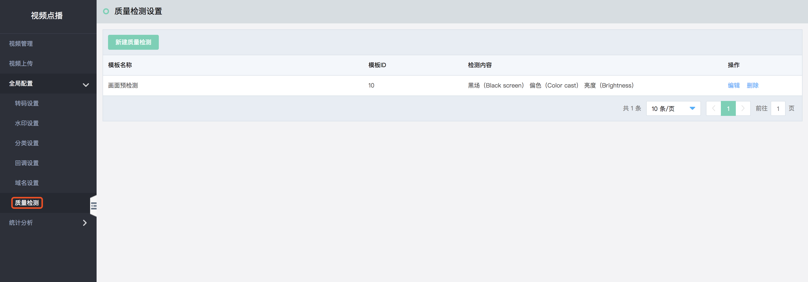

在质量检测页面点击”新建质量检测“按钮，可以创建新的质量检测模板，同时对模板名称和检测的参数进行配置，目前支持6种参数，后续会不断增加可检测的项目。

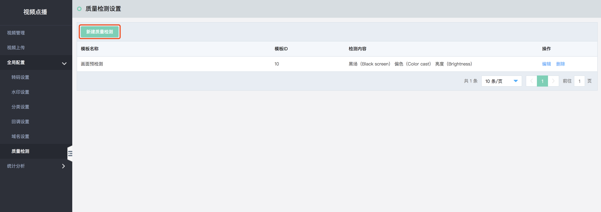

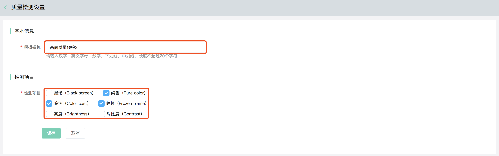

创建完成的质量检测模板会在模板列表中显示，可对模板进行编辑和删除管理。

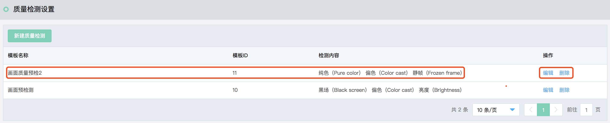

