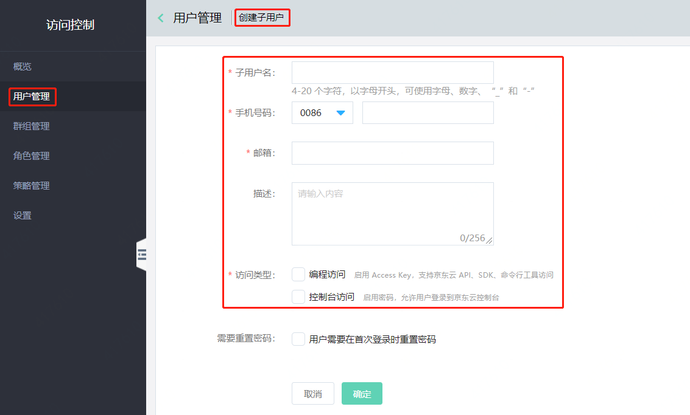
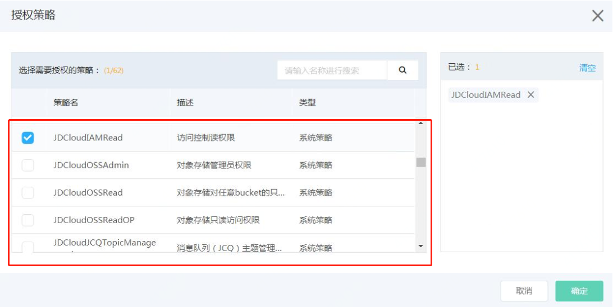

# 访问控制

   访问控制（Identity and Access Management， IAM）是京东云提供的一项用户身份管理与资源访问控制服务。用户可以通过使用IAM创建、管理子用户，并控制这些子用户访问京东云资源的操作权限。使用访问控制，主账号可以向他人授权管理账户中的资源，而不必共享账户密码或访问秘钥，按需为用户分配所需的最小权限，从而降低企业信息安全风险。

-   管理子用户并控制其访问权限 – 您可以在 IAM 中创建子用户，为其单独分配所需的控制台访问密码或者访问秘钥，供子用户访问京东云资源和服务。您可以根据子用户的安全等级设置是否需要开启虚拟MFA认证，是否需要在执行敏感操作的时候进行虚拟MFA验证。您可以通过使用系统策略或者创建自定义策略的方式来控制子用户在特定资源上的特定操作权限。

-   管理 IAM角色及其权限 – 您可以在 IAM 中创建角色并管理权限，以便控制扮演该角色的子用户或服务可以执行哪些操作。您也可以定义有哪个子用户扮演该角色，您也可以使用服务角色或者服务相关角色，指定相应的服务扮演该角色，代表您管理和操作京东云的其他资源。

-   下面对访问控制的使用做个简单介绍，更详细的使用请参考访问控制产品的[使用手册](https://docs.jdcloud.com/cn/iam/product-overview)。

## 1.什么是子用户

子用户是一种实体身份，有确定的用户名，密码和AK/SK，它通常与某个确定的实体一一对应，如企业的技术人员，运维人员等。

子用户的用户名由主账号创建。子用户不是独立的京东云账号，它归属于主账号，只能在主账号的空间下可见，他只有资源的使用权，没有资源的所有权。没有独立的计量计费，子用户的对资源的使用费用将统一计到主账号的账单中。子用户必须得到主账号的授权，才能登录控制台或使用Open API操作主账号授权的资源。

## 2.创建子用户

登录京东云控制台，进入访问控制 > 用户管理，点击【创建】按钮，在创建子用户窗口填写子用户信息，创建成功后，您可以选择下载或者邮件的方式下载子用户的密码和访问秘钥信息。

## 3.给子用户授予策略

访问子用户列表，点击【授权】按钮，可快捷的授予子用户相应的策略，在这里可以选择点播产品授予符合您业务要求的策略。

