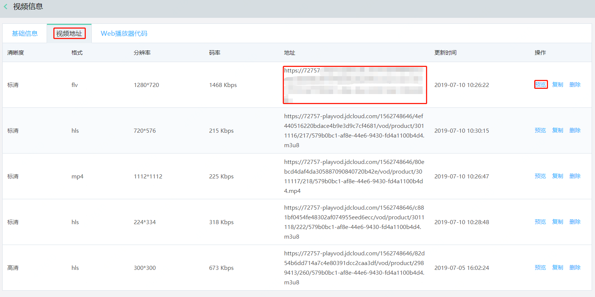
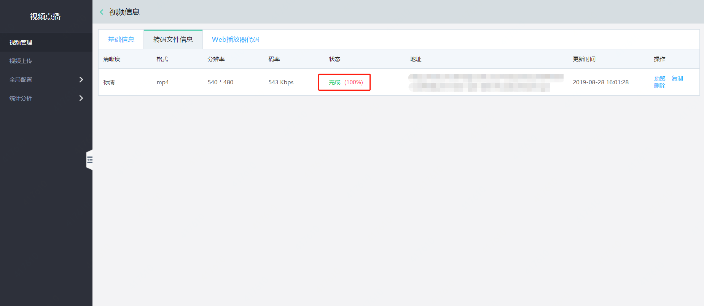
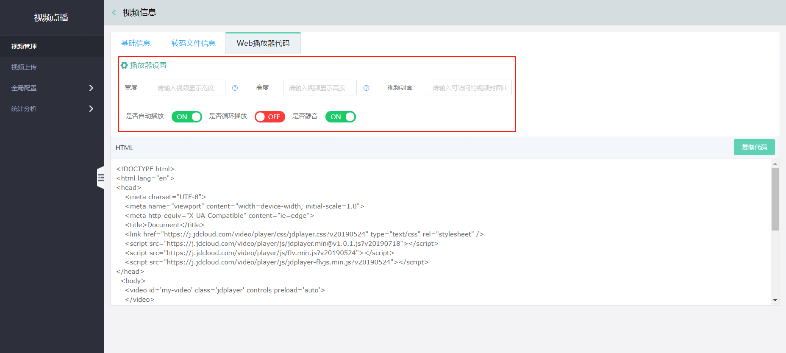

# 视频管理

## 1.视频上传
登录视频点播控制台，点击左侧菜单栏 “视频上传”，进入“文件上传”页面，点击“添加文件”按钮，弹出框中再次点击“添加文件”，即可弹出本地文件浏览窗口，选择文件，点击“开始上传”即可。

## 2.视频管理
登录视频点播控制台，点击左侧菜单栏“视频点播”-“视频管理”，进入视频管理页面。点击视频列表中的“管理”，可进入单个视频文件的视频信息页面，此处可以查看和修改文件名称、分类设置、标签及视频介绍，如果您的视频已经进行了转码处理，则此处会自动生成4个截图供您选择做封面使用。

## 3.视频分类
在视频管理列表后点击管理，进入视频信息页，基础信息中，“视频类别”可以下拉修改分类类型。如需新增或者删除视频分类，可以点击“管理分类设置”，进入分类设置子页面 

点击“新建分类”可在列表中出现“新建分类”字样，点击修改、删除即可完成相应操作。 

## 4.视频播放地址   

在视频管理列表中点击“管理”可进入视频详细信息页，点击“视频地址”标签页可查看不同清晰度规格的视频文件播放地址，也可以对某个视频进行预览播放，请注意如果在全局配置的域名设置中开启了鉴权功能，请参考全局配置域名设置中鉴权设置的说明文档按规则生成带鉴权的地址才能播放。

## 5.转码进度   

提交转码任务后，在视频管理页面，点选要查看视频右侧的“管理”按钮，可以看到每个成品输出视频的转码进度和转码状态。

## 6.Web播放器代码

在视频管理列表中点击“管理”，进入视频详细信息页，点击“Web播放器代码”标签可查看系统自动生成的Web播放器嵌入代码，可以直接点击“复制”按钮，复制争端代码到开发页面中，完成播放页的快速创建和业务对接。

宽度：定义播放器宽度

高度：定义播放器高度

视频封面：播放器首次播放视频时封面图

是否自动播放：播放器是否自动开始播放视频，无需点击播放按钮

是否循环播放：播放器是否循坏播放视频

是否静音：播放器是否设置为静音

**播放器代码参数可参考下表**
	
|参数名|参数说明|取值说明|
|-|-|-|
|autoplay|自动播放设置|true：自动播放    false：不自动播放|
|controls|显示控制条|true：显示   false：不显示|
|loop|是否循环播放|true：循环播放  false：不循环播放|
|aspectRatio|视频显示宽高比|取值为字符串，如“16:9” 、“4:3”|
|muted|静音设置|true：静音  false：非静音|
|width|播放器宽度|取值：字符串或数字，单位像素（px），比如： width:300 or width:'300px'|
|height|播放器高度|取值：字符串或数字，单位像素（px），比如： height:300 or height:'300px'|
    
