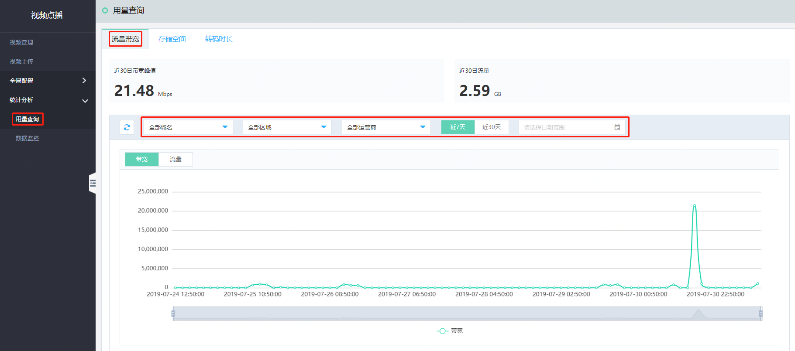
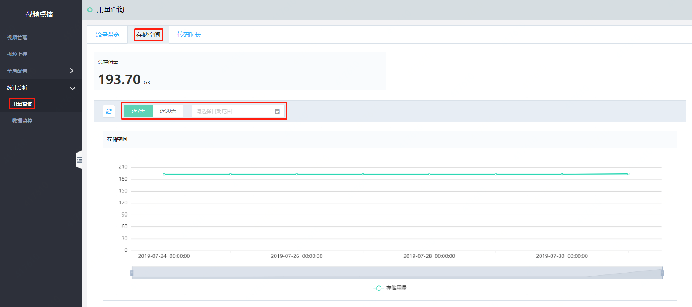
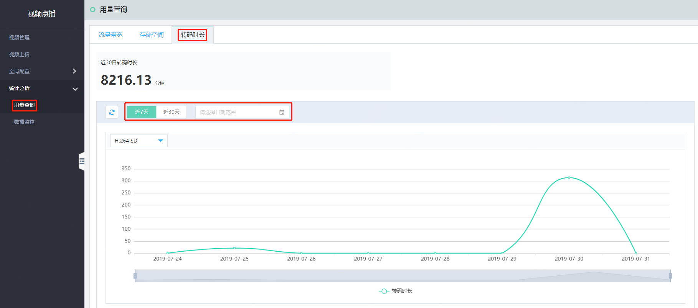
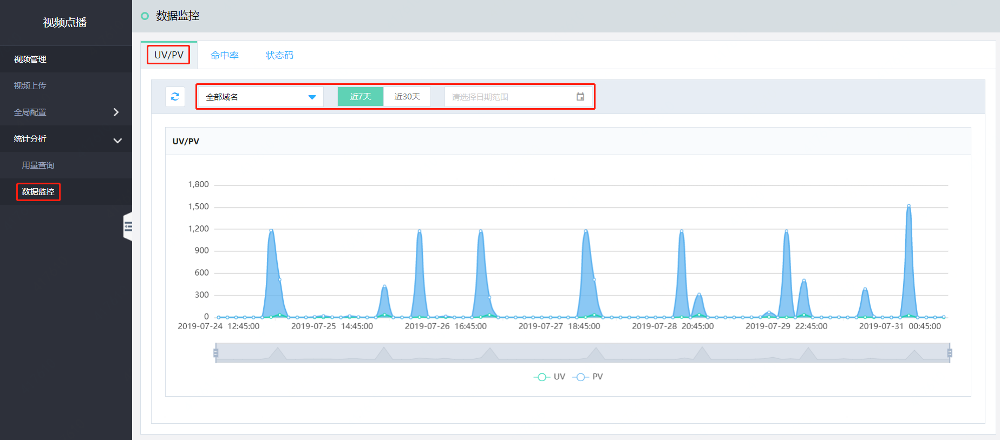
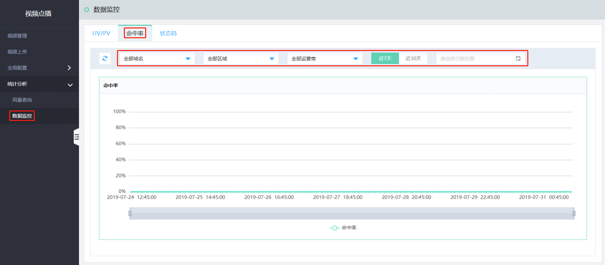
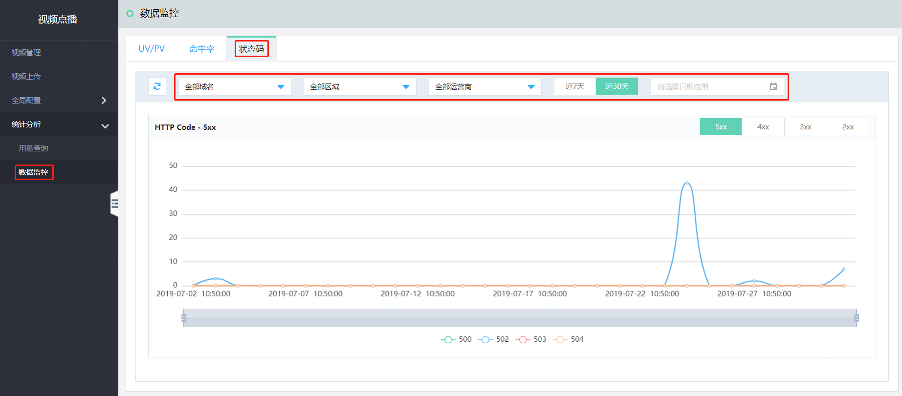

# 统计分析

统计分析主要包括“用量查询”、“数据监控”两个方面的数据展示，可根据需求查询不同的数据作为业务参考。

## 1.用量查询

用量查询页面中可对和用量相关的“流量带宽”、“存储空间”、“转码时长”数据进行查询，同时可通过每个查询项目的查询条件筛选自己想要展示的数据，具体各项可查询条件和数据内容如下：

|数据项|数据内容|查询条件|
|-|-|-|
|流量带宽|流量带宽使用量|域名、区域、运营商、时间粒度（近7天、近30天、自定义时间段）|
|存储空间|存储使用量|时间粒度（近7天、近30天、自定义时间段）|
|转码时长|转码使用时长|转码规格、时间粒度（近7天、近30天、自定义时间段）|

a.流量带宽

b.存储空间

c.转码时长

## 2.数据监控

数据监控页面可对和监控相关的“UV/PV”、“命中率”、“状态码”数据进行查询，同时可通过每个查询项目的查询条件筛选自己想要的展示数据，具体各项可查询条件和数据内容如下：

|数据项|数据内容|查询条件|
|-|-|-|
|UV/PV|PV和UV数|域名、时间粒度（近7天、近30天、自定义时间段）|
|命中率|命中率占比|域名、区域、运营商、时间粒度（近7天、近30天、自定义时间段）|
|状态码|各状态码数量（5XX、4XX、3XX、2XX）|域名、区域、运营商、时间粒度（近7天、近30天、自定义时间段）|

a.UV/PV

b.命中率

c.状态码

