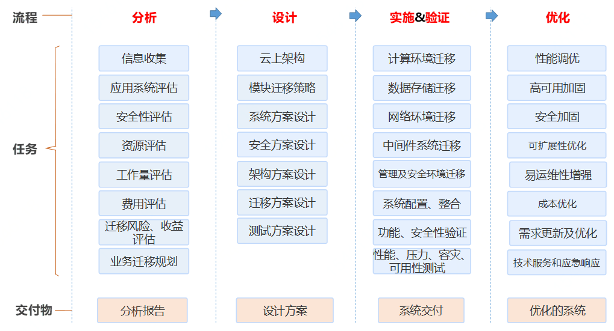

# 迁移方法论

云计算行业中普遍认同的云迁移框架主要分为分析、设计、实施及验证和优化四个部分，如图所示。

在系统迁移分析阶段，通过收集详细的系统信息和用户需求，经过系统、安全性、资源、工作量、费用等评估，根据有效的迁移模型和迁移策略，给出分析报告。在设计阶段，针对用户业务系统的系统架构和主要模块设计云上架构和模块迁移策略，做出系统、安全、架构、迁移、测试等方案设计。在实施及验证阶段，根据迁移方案，通过实施计算、存储、网络、中间件、管理和安全等系统模块迁移，再通过系统整合实现系统完整迁移。针对功能、性能、可用性、可靠性、安全性、容灾性等方面进行综合验证，得到完整的验证评估报告。在优化阶段，通过性能调优、高可用加固、安全加固、提升服务质量等实现系统的改进。
