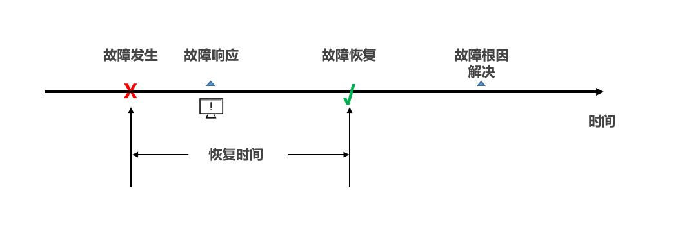
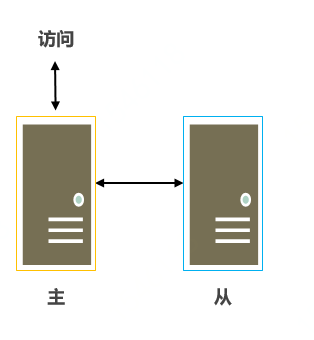
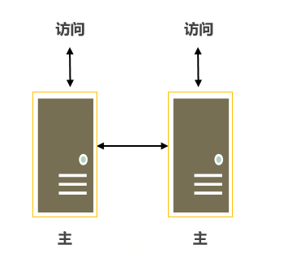
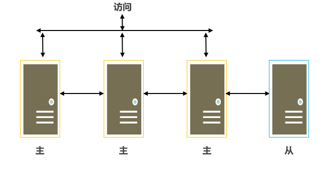
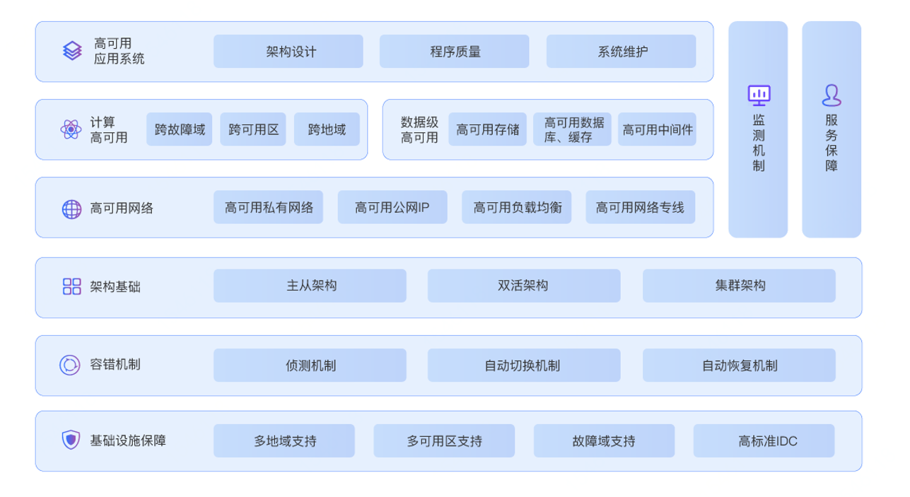

# 构建高可用的系统

## 可用性

对于IT系统，可用性是指在指定的一段时间范围内系统可以被访问和可以被使用的能力。若系统在指定的时间范围内因故障或某些操作导致不能被访问和被使用，则系统的可用性就会下降。对于需要连续运行并提供服务的系统，可用性是非常重要的系统质量好坏的评判指标，尤其对互联网企业和关系民生、安全等重要IT系统具有高可用性极为重要。提升云上的系统的可用性是云厂商和用户IT部门的共同责任，因为云厂商提供云上资源，而用户需要通过良好的设计将这些资源进行科学合理的组合，形成质量较好的系统。

衡量系统可用性的指标有很多，其中最重要的是“恢复时间目标”（Recovery Time Objective，RTO），是指信息系统从灾难状态恢复到可运行状态所需的时间，用来衡量容灾系统的业务恢复能力。

                                 

京东云对用户提供的可用性SLA主要有（其中服务周期按月计算）：

- 云主机、原生容器、RDS（关系数据库服务）提供的服务可用性不低于99.95%。

- 对象存储提供的服务可用性不低于99.9%。

- 负载均衡、CDN提供的单实例服务可用性不低于99.9%。

## 高可用主要技术

#### 容错机制

通过引入容错机制可提升系统可用性。主要的容错机制包括侦测、自动切换、自动恢复。

侦测机制是利用在计算节点外部部署的监听程序侦测该计算节点是否正常运行。通过侦测机制可以了解计算节点的活性，并可以根据计算节点的状态进行系统调整，防止由单个计算节点的故障影响整个系统的正常运行。

自动切换机制，是在侦测阶段发现计算节点故障后，利用其它的计算节点来接替发生故障计算节点处理的工作，使业务能正常运行。

自动恢复机制，是完成自动切换之后，通过离线或在线的方式让故障计算节点恢复到可正常工作的状态，再根据故障处理的策略选择将业务恢复到原计算节点上或者让原计算节点作为正在工作的计算节点的备用计算节点。

#### 高可用架构

基于容错机制，实现高可用系统的云上架构主要有主从架构、双活架构、集群架构等。

主从架构是一种非对称的容错架构，分为主计算节点和从计算节点。主计算节点用来处理业务请求，从计算节点具有和主计算节点相同的能力但不处理业务请求，而一般情况下只侦测主计算节点的活性。当主计算节点宕机时，从计算节点接替主计算节点进行工作。主从架构分为主从热备和主从冷备两种。主从热备架构中从计算节点与主计算节点同时运行。主从冷备架构中从计算节点不与主计算节点同时运行，当主节点出现故障停机时，需要手动启动从计算节点。主从架构中，若从节点的个数大于等于2，则称为副本集架构。通过增加从节点个数可实现更高的可用性，但管理复杂性也会相应增加。

​               

​                               

双活架构是一种对称的容错架构，分为两个等同的计算节点。两个计算节点都处理业务请求，并互相侦测对方的活性，若有一方出现故障则另一方会将故障一方的任务接手处理。当故障计算节点恢复后，两个计算节点再度同时处理业务请求。

   

集群架构是以上两种架构的扩展，采用多个计算节点处理业务请求，当某一计算节点出现故障后，集群中选择一个或多个计算节点代替故障计算节点处理业务请求。

## 京东云高可用架构支撑

   

京东云基于长期的技术积累，构建了完整的能够支撑高可用架构的技术体系。基于京东云稳固的基础设施保障，利用有效的容错机制和可靠的架构基础，研发出能够支撑用户高可用业务应用系统的计算、数据、网络等技术先进的云计算产品。
