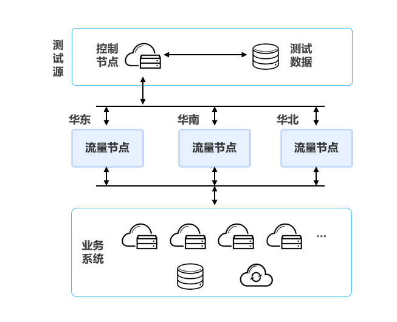

# 构建高性能系统

## 性能概述

系统的性能是在指定的时间范围内系统处理任务的速度。在云计算平台上，不同规格的资源实例能够对外输出不同的处理能力，因而影响系统的性能。京东云通过在多个地域向用户提供同一产品的多种规格实例，帮助用户利用丰富的资源构建满足自身业务系统性能需求的系统。

## 性能提升方法

#### 利用云计算平台产品构建高性能系统

京东云提供一系列高性能IaaS和PaaS产品，为用户实现高性能业务系统奠定基础。京东云产品指标都按业内最高标准进行设计，包括CDN响应时间、云硬盘吞吐率、私有网络带宽、负载均衡请求处理速率等指标都达到业内先进水平。用户可以利用京东云产品构建符合性能目标要求的系统。

#### 通过性能测试提升系统性能

要构建高性能业务系统，需要进行全面的性能测试，找到系统性能瓶颈并进行性能优化。

                                       

基于用户业务系统设计目标，可以对系统进行基于真实业务场景的大流量测试。通过模拟极端业务压力，测试系统的负载承受能力和稳定性。部分系统问题，只有在系统持续运行一定时间后才会表现，因此需要在系统上线前进行长时间高负载性能测试。通过性能测试和评估，可以掌握云资源和业务承载力的关系，并通过对云主机、云硬盘、数据库、带宽等资源数量和规格的调整，实现资源最优配置。
