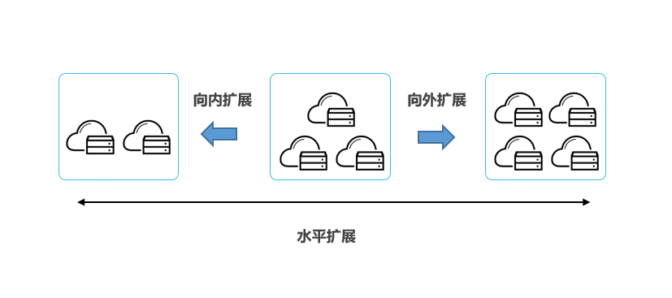
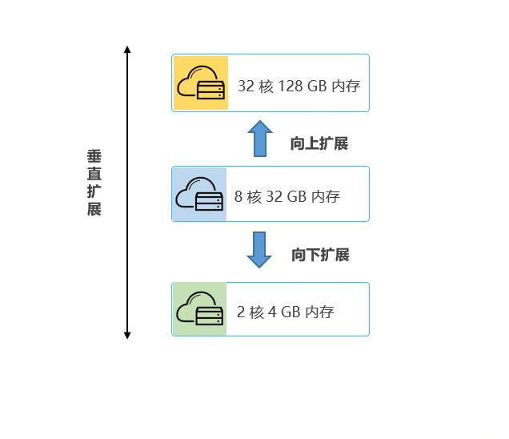
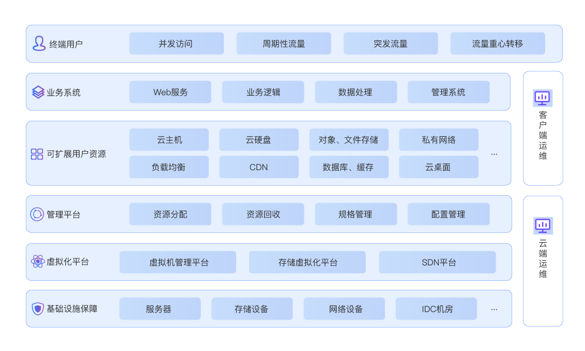

# 构建可扩展的系统

## 系统扩展方法

可扩展性是指云计算平台上的资源可以处理增加或减少的使用需求的能力，反映了资源在弹性范围内变化能够适应工作负载波动的能力。在京东云上搭建业务系统，实现系统可扩展的目标是让系统运行过程中能够利用云计算平台资源实现理想性能的同时降低资源成本开销，同时使系统能够更好适应业务发展的需要，能够平稳处理突发流量等极端情况。

#### 水平扩展

云计算平台上资源的水平扩展包括资源的向外扩展和向内扩展。水平分配新的资源即为向外扩展。水平释放冗余的资源即为向内扩展。对云计算平台上的资源进行水平扩展简单易行，并结合高可用架构设计方法，跨故障域、跨可用区或跨地域对资源进行向外扩展，可以使系统具有更高的可用性。

​                                                

#### 垂直扩展

云计算平台上资源的垂直扩展包括资源的向上扩展和向下扩展。垂直提升资源的容量或能力等规格即为向上扩展。垂直降低资源的容量或能力等规格即为向下扩展。由于在云计算平台上对资源进行垂直扩展时需要先停止资源实例，需要用户业务系统能够承受一段时间的资源实例不可用。

  

## 京东云主要产品可扩展性

#### 可扩展架构

京东云基于不断的技术探索和技术经验积累，构建了完整的能够支撑高可扩展性的技术体系。基于京东云稳固的基础设施保障，利用先进的虚拟化平台技术和功能强大的资源管理平台，研发出能够支撑用户实现资源可扩展的计算、存储、网络等云计算产品，助力客户实现具有高可扩展性的业务系统。

   

