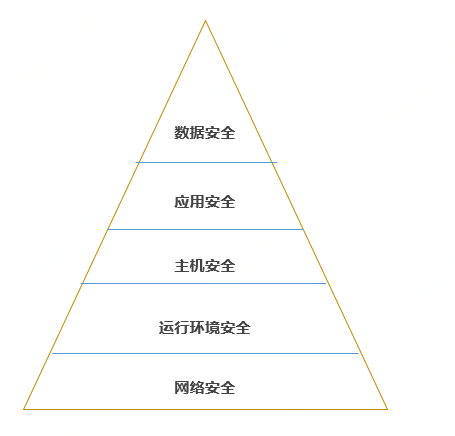

#  构建高安全性的系统

## 安全威胁与防护

#### 云上系统主要安全威胁

云安全联盟发布的“十二大云安全威胁”阐述了用户用云过程中面临的主要安全威胁。其中，对于用户构建云上业务系统，主要将面临如下安全威胁：

**数据泄露**。它是2018年最严峻的安全威胁，Facebook和国外政府部门都因数据泄露造成巨大损失。若无保护措施，云平台上业务系统也面临数据泄露风险。

**数据丢失**。硬件故障在云计算平台上较为常见，需要依赖更好的技术手段防止由于部分硬件的故障导致用户的数据丢失。

**未授权的访问**。未被授权的情况下，攻击者可能通过某种技术方法访问云平台上应受保护的用户系统和资源。实现未授权的访问是进一步攻击和破坏的基础。

**系统漏洞利用**。攻击者可以采用技术手段利用系统漏洞实现系统突破，进而进行更大的破坏和威胁。用户需采取必要措施防止系统漏洞被攻击者利用。

**渗透攻击**。公网上的业务系统容易遭受渗透攻击，因此用户需借助安全防护措施更好地保护系统。

**分布式拒绝服务（DDoS）攻击**。DDoS攻击是公网服务器容易遭受的攻击。据中国电信云堤和绿盟科技公布的数据，2018年监测到14.8万次DDoS攻击。因此几乎时时刻刻都在发生DDoS攻击。用户需要采用必要的抵抗DDoS措施。

#### 安全防护模型                                                    

根据系统受到威胁和被攻击的层次，将云上系统安全划分为五层结构，从外向内分别是网络安全、运行环境安全、主机安全、应用安全和数据安全。京东云重点在每个安全层上建立安全防护机制，从而全面的保障用户系统安全。

 　　　　　　　　　　　　　

## 京东云安全保障

#### 云安全架构

   

京东云遵循业界先进的安全标准保障用户系统和数据全生命周期安全，采取平台安全保护措施、安全管理和信息安全技术等手段进行全面安全体系建设。在云平台的基础安全防护方面，京东云从数据中心自身的安全容灾，到设备的选型和测试、产品和平台的研发设计、数据和网络的访问及控制，经过了严格设计和全面测试，最终为用户提供安全、可靠、稳定易用的云服务。在安全产品和服务方面，京东云为用户提供网络安全 、运行环境安全、服务器主机安全、应用系统安全、数据安全等多层次立体式的安全产品集，再加上合作伙伴提供的安全服务，为用户在京东云上提供全面的安全保障。
