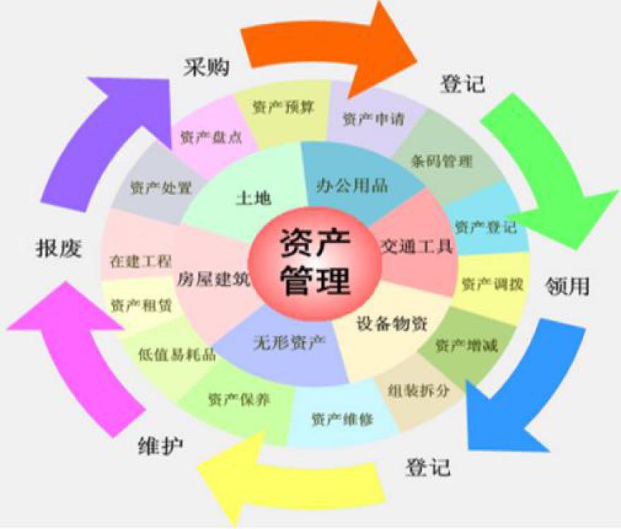

# 合众数字化资产管理系统介绍 
合众资产管理，汇聚数千家不同领域企业的资产管理成功实践，推出新一代的“云+端” 资产管理解决方案。线上结合线下的方式为您提供资产的全生命周期管理，让我们为您的资产贴上专属的条码，通过微信和 PDA 扫一扫即可获知资产的相关信息,资产归属问题迎刃而解。全员手持扫描枪或者手机即可对资产进行量盘点，盘点数据实时传递。通过现代的4G技术和二维码技术结合。通过简单的场景化体验，来感受：从资产申购——资产入库——资产申领——资产转换——资产盘点——资产维修维护保养——资产价值的全生命周期管理。 

