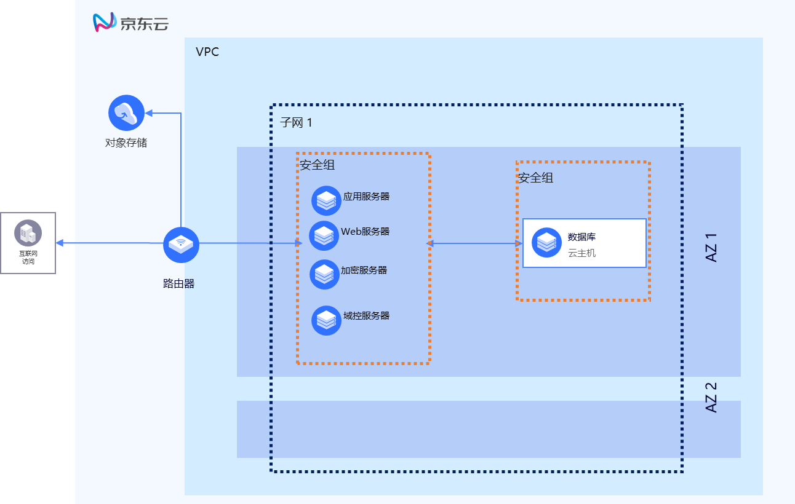
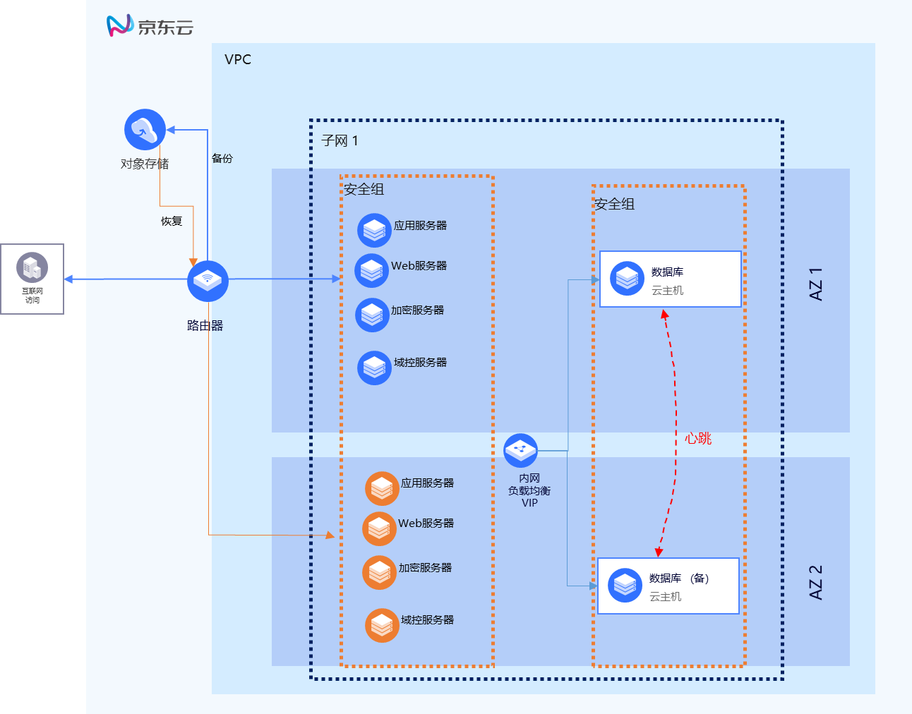

# 5	U8+在京东云上的最佳实践 

下图是一个用友 U8+在京东云上的部署案例，此部署案例中，用友 U8+部署采用多服务器部署方案，数据库、应用层、加密层、web 服务系统均分别单独部署在专用服务器上，适合于较大规模部署的案例。在小型的应用场合，业务量较小，采用单机部署方案，只有不超过 10 个并发客户端的情况下，可以将中间层和数据库安装在同一台服务器上。

## 5.1	网络最佳实践 

- 私有网络 VPC 设计。 
VPC 是云上的私有网络，为客户的应用提供一个独立的私有网络环境。客户在京东云上部署用友 U8+时，需要规划一个独立的私有网络。与其他客户进行网络隔离。

- 子网设计。 
对于用友 U8+的部署，可以建立 1 个或 2 个子网，用于用友 U8+的单机部署或分层部署，将应用层服务器放置于一个子网，数据库服务器放置于一个子网。 

- 弹性 IP 设计。弹性 IP 可以让客户的应用实例和广域网联通，供客户远程访问应用。应用部署到京东云上时，需要为应用申请一个弹性 IP。客户现在通过应用虚拟化的客户端访问应用，弹性 IP 也用于应用虚拟化的 server 端 IP 地址，向广域网发布应用。 

- 安全组设计。安全组用于云主机实例的安全防护。为了安全起见，安全组应只允许必需的端口访问通过。如使用应用虚拟化产品访问时，可只开通应用虚拟化所需的端口即可。 

## 5.2	可用性最佳实践  

利用京东云的多可用区特性可实现应用的高可用，为了利用多可用区特性实现应用的高可用，需要应用本身能够支撑分布式高可用部署。对于用友 U8+，基于成本及 RTO 推荐标准方案部署的要求，我们高可用机制可采用如下方案，如下图所示。 
-	数据库高可用部署。将部署数据库的云主机分布到不同的 AZ，并将其安装的数据库配置成双机热备的高可用方式。数据库前端部署负载均衡，实现数据库访问的负载均衡。 
- 将应用服务器分布式部署到 1 个可用区，并制作应用服务器的镜像，在 region 级镜像可用。 
- 当生产环境部署的可用区出现问题时，可基于镜像在其他可用区创建应用层云主机，恢复业务。 

## 5.3	可扩展性最佳实践 

用友 U8+软件本身为成长型企业打造，支持多种部署方案，单机全量部署或应用与数据库分离部署一般即可满足企业的并发性能要求和扩展性要求，如客户端更多，可采用多应用服务器的部署模式。 

- 应用和数据库分离部署。为了应付客户端较多、并发连接较多的情况，可以将应用服务器和数据库服务器分离部署，充分发挥不同角色服务器的性能。 

- 多服务器部署。当客户端数量超过 10 个，应该把每个服务器角色分开单独部署，并且建议这些服务器专用于 U8+服务，不建议用其他企业应用服务器(例如 AD、DNS、Mail 等)兼任。这样才不至于多种服务争抢服务器运算资源，影响用友 U8+系统的运行性能。。

- 纵向扩展。为了满足性能的要求，可以提升服务器的规格，让应用的业务处理能力更强，用户体检更好。例如开始可以选择 2C4G 的 c.n2.large 的规格类型，随着业务的快速发展可将规格类型变为 4C8G 的 c.n2.xlarge。关于京东云主机规格的类型可以参考[京东云主机帮助文档](https://docs.jdcloud.com/cn/virtual-machines/instance-type-family)。  
