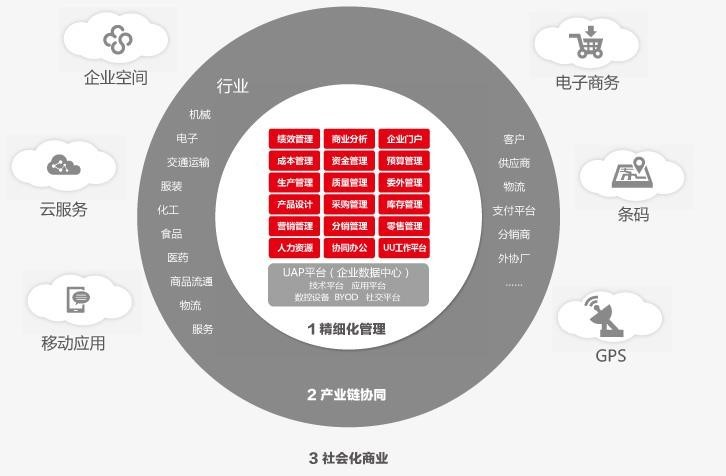
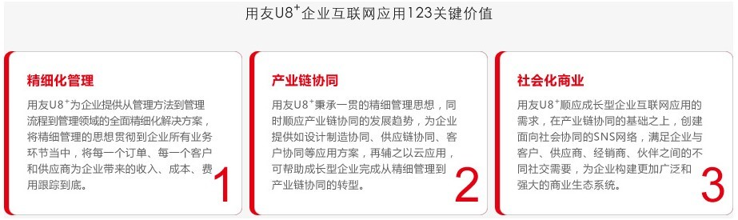

# 用友 U8+介绍

用友 U8+成长型企业互联网应用平台，为成长型企业提供预配置的管理与业务实践，以企业全面精细化管理方案为核心，融入互联网时代的新兴元素：移动技术、网络营销、电子商务、体验营销，帮助企业实现产业链协同，拓展企业社交化应用，推进企业经营管理模式变革，助力企业基业长青。

用友 U8 为成长型企业提供了十二大互联网应用模式，包括营销服务一体化、电子商务、供应链协同、设计制造一体化、精益生产、精细管控、人力资源、办公协同、移动应用、大数据分析、社交化协同和云服务，成长型企业可以按照不同的管理需求，选择合适的模式。 
U8 支持企业实现商业软件的多端（PC、手机、平板等多种设备）多系统（windows、iOS、 Android 等主流系统）应用部署，实现跨屏应用，结合多种业务协作场景与业务处理流程，发挥移动设备便携特性及互联网广域优势，全面提升企业对最前端客户的消费行为、销售经理及团队的营销行为和营销通路的商业数据采集效率、关键营销业务的审批与处理效率，对提升企业整体市场竞争力，快速洞察市场变化，提升市场响应速度有巨大帮助。 
用友 U8 支持各类企业全生命周期的经营与管理，包括单体（含多工厂）产业链协作经营，多渠道经营的工业及商贸企业,可以灵活部署 按需配置 

