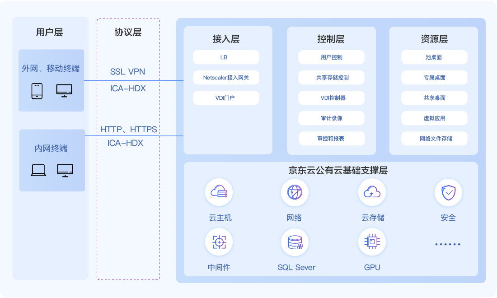

## 云桌面基础技术

京东云云桌面包含用户层、协议层、接入层、控制层、资源层、基础支撑层等六个模块层次。

**用户层技术**

云桌面利用Citrix UPM（User Profile Management）技术，允许用户全面定制个人桌面。配置文件在用户退出时导出到中央存储库中，在用户重新登录虚拟桌面时，配置文件被加载，用户定制的个人桌面自动生效。用户数据可与云桌面分离，采用漫游配置文件和文件夹重定向功能，将用户配置和数据漫游或重定向到云桌面外部的服务器上，实现随时更换云桌面但能同步配置和数据的功能。

**协议层技术**

云桌面支持HTTP和HTTPS协议，采用ICA HDX 协议支持虚拟桌面。ICA HDX协议由32个虚拟通道组成，不同的通道负责传输和优化不同的连接类型，包括语音通道、图像通道、高清图像通道、打印、剪切板、USB等各种通道。远程图像传输采用矢量数据处理方式，把图形数据分为位图、文字、图形命令，再通过压缩算法传至终端，而后渲染显示。支持自适应传输EDT，在高延迟和高丢包率的情况下自动采用UDP，保障用户桌面连接的基本体验。

**接入层技术**

支持NetScaler Gateway技术，整合了远程访问基础架构，无论应用程序托管在数据中心、云端还是作为 SaaS，提供针对所有应用程序的单点登录。允许用户从任何设备通过 URL 访问所有应用程序。

**控制和管理层技术**

云桌面支持通过策略实现访问云桌面的会话规则的设置，包括用户、设备、连接类型、带宽和安全性。

**资源层技术**

资源层包括用户可访问的云桌面、虚拟应用和共享的存储。云桌面包括共享桌面、专属桌面和池桌面三种桌面类型。在共享桌面类型下，多人同时登陆一台高规格的云桌面主机，不保留个人对主机操作系统的更改。在专属桌面类型下，一台云桌面主机专门指派给一个用户，可以保留个人对主机操作系统的更改。在池桌面类型下，云桌面主机和用户是一对一关系，但控制层不保留这个对应关系。

**基础支撑层**

京东云IaaS为云桌面提供底层基础资源。京东云第二代云主机采用最新一代英特尔至强金牌处理器（Intel Xeon Gold 6148 Skylake），提供通用型、计算优化型、内存优化型及高频计算型等四类规格。云桌面根据客户用户数量选择云主机规格类型及对应规格，按需分配CPU、内存、硬盘存储和公网IP。硬件层依赖上层设计，支持企业内部数据中心的服务器虚拟化、私有云、混合云和公有云IaaS。

