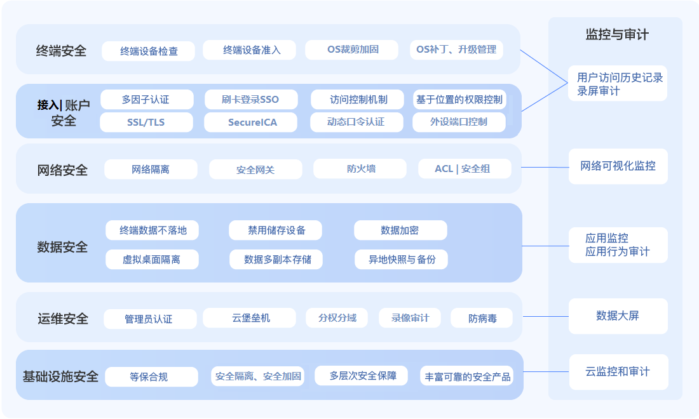

##  云桌面安全技术

保障系统和数据安全是客户选择云桌面最主要的原因之一。云桌面不仅与传统虚拟桌面系统一样可实现对用户数据的集中安全保护，还能从终端安全、账户安全、网络安全、数据安全、运维安全、基础设施安全和安全监控与审计等七个方面实现全方位安全保障。

**终端安全**

云桌面终端是部署在用户侧的桌面接入设备，由于其分布分散且不可控，故保障终端安全有很大挑战。云桌面采用严格准入措施控制只有安全可靠的终端能接入到云桌面平台上。在终端设备接入到云桌面平台之前，需要对设备进行全面的检测。对于PC机和瘦终端，需要对操作系统、软件补丁版本、注册表、证书和杀毒软件进行检测。对于平板电脑、手机等移动终端，需要对系统进行检测。防止有安全隐患的终端接入到云桌面平台。在终端设备上安装证书，证书与设备绑定，确保合法终端才能接入云桌面平台。                                          

**账户和访问安全**

采用多因子认证、访问控制机制、基于位置的权限控制等安全机制，并支持单点登录。支持多因子认证，可通过RSA SecrueID、智能卡、SafeWord一次性密码验证、RADIUS远程认证、用户口令等方式登录。通过细粒度的安全访问控制机制，实现剪切板监控、USB数据访问监控、打印机等设备访问控制。基于位置的权限控制机制可区分不同位置接入的用户，针对内外网不同的风险等级，控制用户的访问权限，防止业务核心数据在不可控的环境中泄漏。为了保证系统安全同时又提升用户访问各个系统便捷性，提供单点登录功能。

**网络安全**

通过安全的接入网关将用户终端不安全网络与云桌面平台系统进行网络隔离。云桌面所在的网络位于高安全保护级别的安全子网内部，有效防止客户核心业务系统被网络入侵。云桌面通过部署多层网络安全产品，对安全内网应用和系统进行保护，使恶意攻击者无法进入内部系统。若客户将桌面系统部署在京东云公有云上，则获得专属VPC，通过应用安全网关、访问控制、安全组等措施保证网络安全。

**数据安全**

数据安全是保障客户业务安全的关键，为此京东云在保障客户数据安全方面采用了终端数据不落地、数据加密、禁用存储设备、虚拟桌面隔离、多副本、快照与备份等多种安全防护措施，有效地保障了客户的数据安全可靠。在用户终端侧，只接收云桌面平台发来的屏幕变化指令，只能向平台发送键盘和鼠标指令，业务数据不能在用户终端上落地存储。同时，支持将用户行为封闭在云中，剪切板只能单向云桌面复制数据、文件只能单向从外部复制到云桌面上。可禁用存储设备，实现数据不出云、代码不出云，对客户业务数据进行有效保护。支持不同网络环境下用户终端到云桌面平台进行安全的TLS传输加密、Secure ICA和SSL ICA会话加密等多层数据加密传输。支持数据存储加密功能，对客户的高敏感数据进行落地存储加密保护。在虚拟桌面层次，支持不同虚拟桌面之间有效隔离，不同桌面间在没有授权的情况下无法访问其它桌面的数据。为了防止客户业务数据丢失和不可用，云桌面通过数据多副本存储和采用异地存储快照和备份等技术保障用户数据的高可靠性。

**运维安全**

通过对管理员登录严格认证，确保仅合法管理员对系统进行管理和维护。支持部署云堡垒机管理云桌面平台基础资源，实现了系统运维的统一账号认证、操作日志审计等安全功能。防病毒方面，采用两级防病毒控制机制。首先，在文件服务器上实现统一的防病毒操作。其次，在用户的桌面虚拟机上采用自动恢复方式，当用户退出桌面后会自动清除用户数据之外的临时数据。

**基础设施安全**

云平台基础安全防护方面，从数据中心自身安全容灾，到设备选型、产品和平台研发、数据和网络访问控制，均经过严格设计和全面测试。安全产品和服务方面，为用户提供网络安全 、运行环境安全、服务器主机安全、应用系统安全、数据安全等立体式安全产品集，加上合作伙伴的安全服务，实现全面安全保障。

**监控与审计**

为了保障安全措施有效执行，通过对云桌面进行全面监控与审计，确保尽早发现安全问题和安全故障可追溯。终端和账户安全层支持用户访问历史记录和录屏审计功能，提供各次会话带时间戳的记录，对终端屏幕录屏和压缩存储。对截屏、录屏、拍照等操作增加水印信息。网络安全层实现了网络的可视化监控，及时发现不安全网络流量。数据安全层实现了应用行为审计和监控，监控和预警应用的高风险操作。运维安全层实现了数据大屏功能，系统资源情况清晰展现，便于及时发现系统问题和故障。基础设施安全层提供业界领先的云监控等功能。
