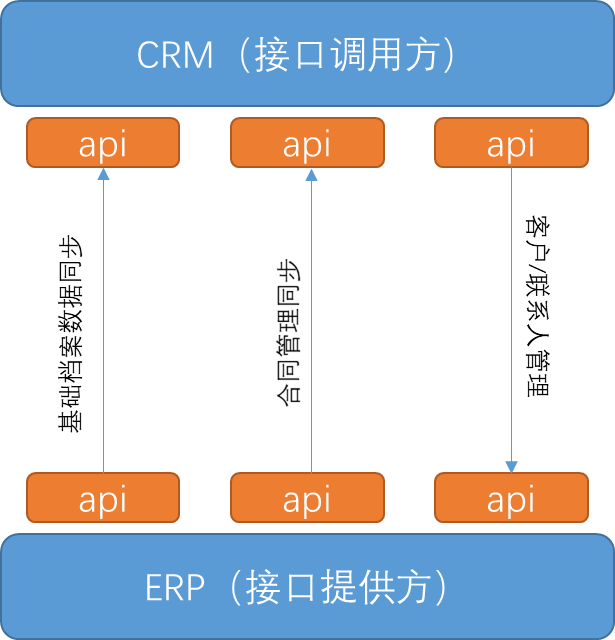

# 应用集成 API 功能介绍

合众唯一在长期为客户的企业应用专业服务中，抽象出了很多共性的功能，如不同应用系统间的数据同步，多个应用系统的数据汇总等等功能。本文中列举了部分集成的功能模块。 

- 功能模块一：基础档案数据同步，ERP 到 CRM，单向同步，含物料、人员、部门、组织机构，接口提供方 ERP(webapi)，接口调用方 CRM。 

- 功能模块二：合同管理同步，ERP 到 CRM，单向同步，接口提供方 ERP(webapi)，接口调用方 CRM。包含合同明细、开票信息、实际回款、回款节点。 

- 功能模块三：客户管理，联系人管理，在 CRM 中录入信息，CRM 将信息同步到 ERP，单向同步，接口提供方 ERP(webapi)，接口调用方 CRM。 

