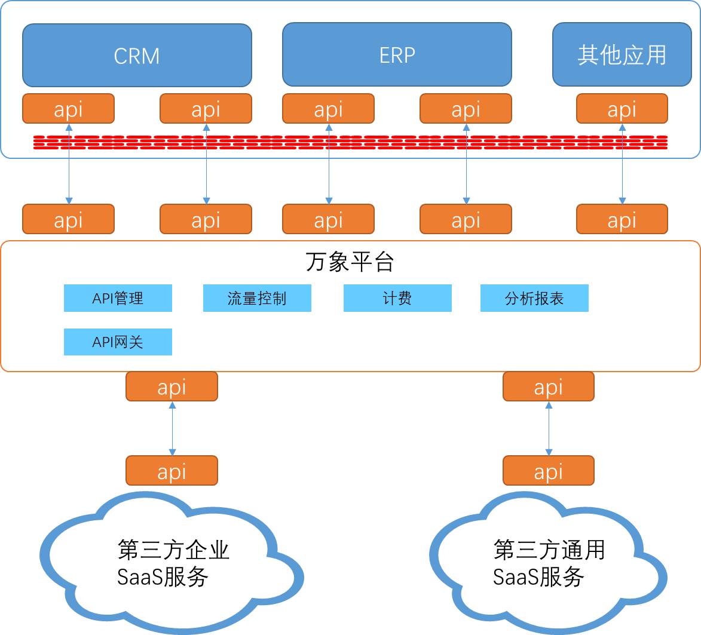
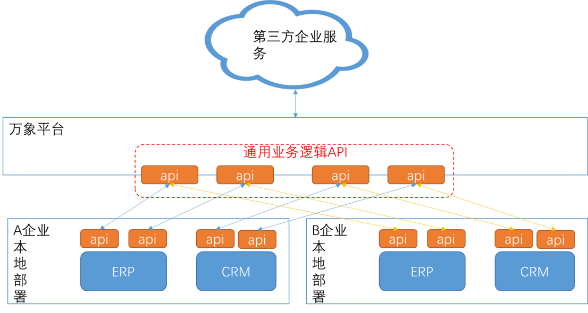
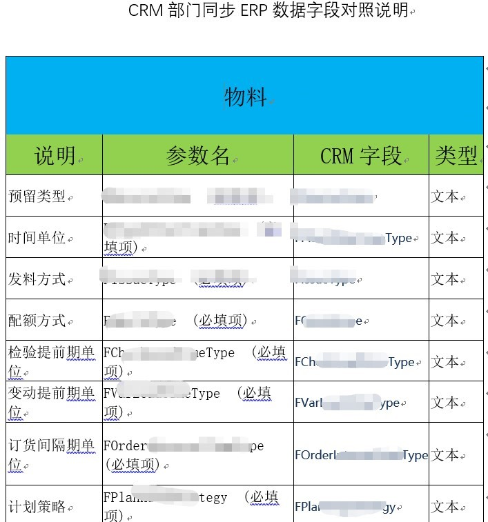
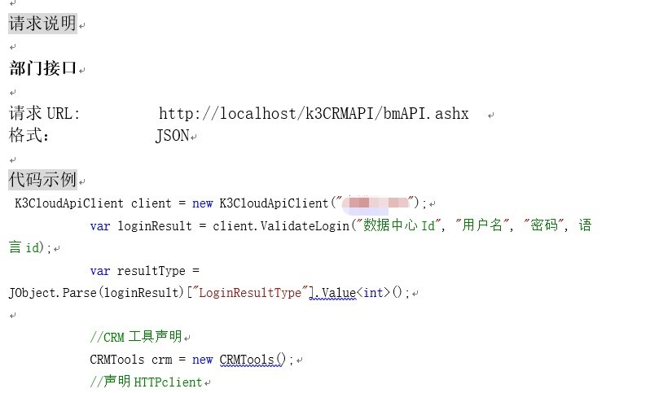
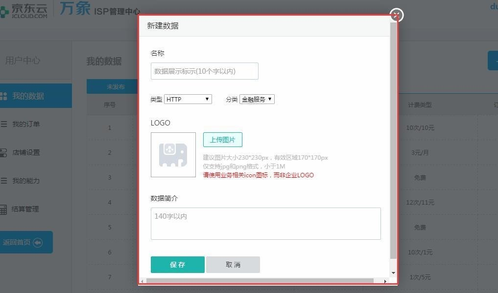
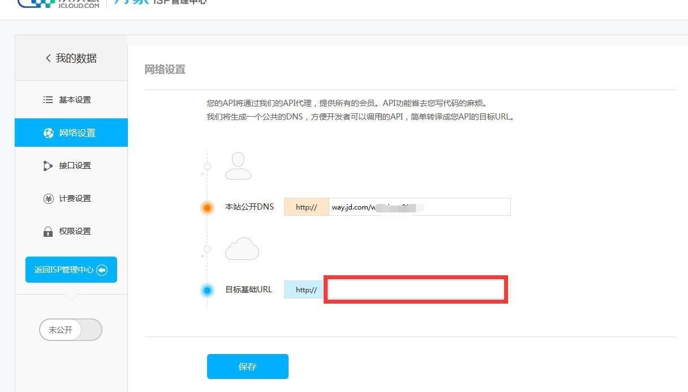
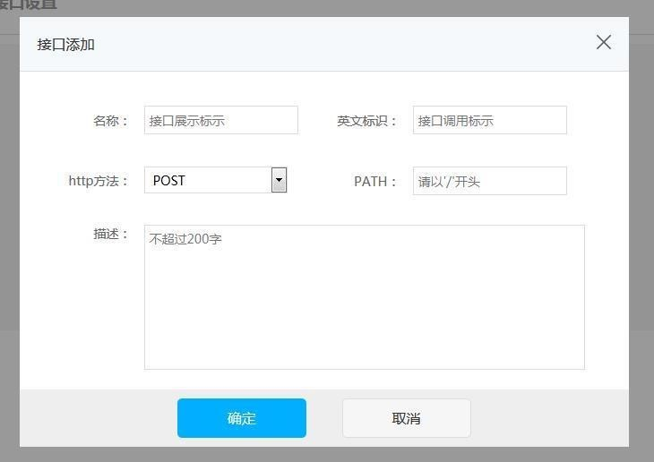
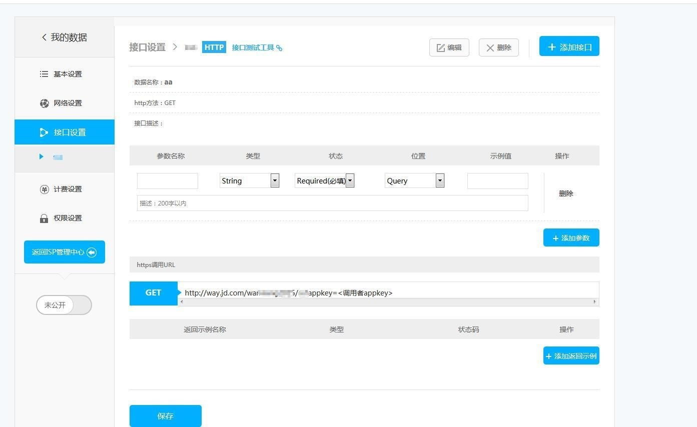

# 应用集成 API 在万象的最佳实践

## 1 整体架构 
万象平台作为中间层，可以帮助企业实现应用的快速集成，并且减少了集成的复杂度。 

下图中包含几个模块。 

1. 万象平台。万象平台在此处充当 API 网关的作用，用于连接为各个应用系统封装API，并形成统一的 api 端点。

2. 企业应用模块。企业应用模块一般部署到客户的数据中心或云上的私有网络中，有防火墙或者安全组负责边界防护。企业应用间相互会有调用关系，用于完成一些业务逻辑。 

3. 第三方企业 SaaS 服务。第三方企业 SaaS 服务主要是指提供 ERP、CRM 等企业管理软件服务的公司，也提供标准的 API 供第三方调用。 

4. 第三方通用 SaaS 服务。通用 SaaS 服务主要指提供通用数据信息的 SaaS 服务，如天气信息、身份认证信息、短信服务等等常规普遍服务。 

## 2 业务逻辑

### 2.1 调用模型

本次最佳实践集成的双方是 CRM 和 ERP 系统，通过万象将各自 API 暴露在万象平台上， 即可以实现双方的对接，又可以提供第三方对接的能力。本案例将业务涉及的的物料、部门、员工、组织机构、客户、联系人、合同管理、应收款管理在 CRM 和 ERP 系统之间做数据集成。涉及的接口以标准的 WebAPI 方式提供双方接口，自动实现 ERP 的基础数据同步功能。

本案例中，将内部调用的 API 发布到万象平台上变为通用业务逻辑 API，不但可以为 A 企业使用，而且可以为 B 企业及其他第三方调用。

### 2.2	参数说明概览

下图为本案例中数据同步的相关字段截图，接口参数梳理清晰后，在万象平台录入 API 及参数即可。

接口调用样例

### 2.3	万象平台配置样例 

1. 新建 API。 
弹出新建数据页面，输入相关数据信息

2. 网络设置进入网络设置，输入目标基础 url，点击"保存"按钮。

3. 接口设置页面

4. 编辑接口参数

5. 接口测试 
对接口信息录入后进行自测

点击图上的接口测试工具，进入接口测试页面

