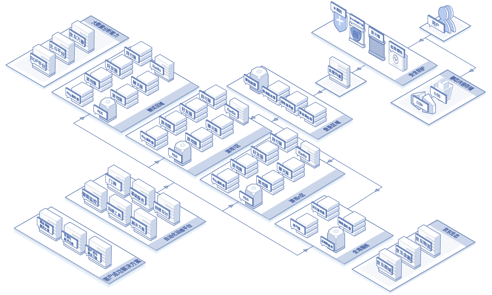
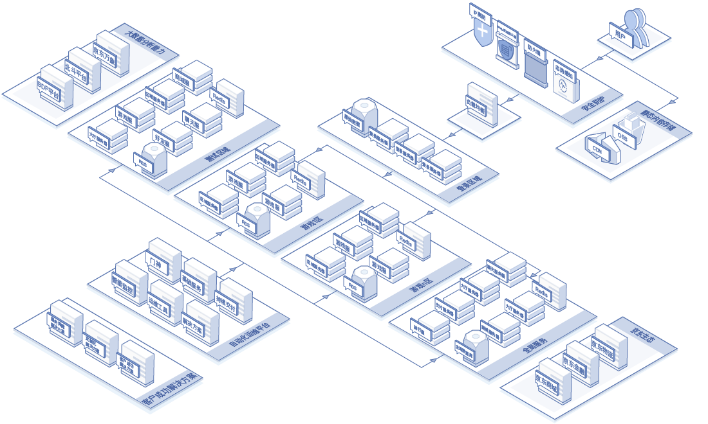
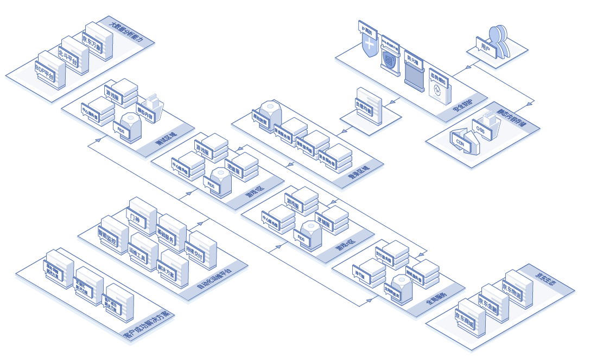

##  行业技术解决方案

游戏的种类千差万别，不同类型的游戏及其游戏玩家对于基础设施、网络和游戏体验的要求均不相同。京东云针对不同游戏类型的特点和需求，分别提供了针对性解决方案。

###  MMORPG

MMORPG游戏作为大型多人在线类游戏，一般采用场景服务器的部署模式，有同服玩家数量多、长连接数量多，网络通信频繁、硬盘读写频繁以及对实时性要求较高等特点。可以看到MMORPG游戏对于云主机的性能要求极高。针对MMORPG的这一需求，京东云提供了高频云主机，可以应对MMORPG对于场景服务器的高性能要求。

MMORPG游戏服务器通常为集群部署，以应对流量高并发和业务高可用的需求。通过京东云高可用组产品，游戏运营商可以将属于同一业务的游戏服务器部署在跨可用区部署在京东云同一区域中，且可用区内的服务器均匀分布在不同故障域中，最大限度地保证了游戏业务的连续性，为玩家提供流畅的游戏体验。

### MOBA

MOBA类游戏一般采用多战斗节点部署的方式，游戏会为每场战斗单独分配房间实例，通常有10名玩家会加入游戏并登陆战斗节点，游戏数字需要在这10名玩家之间实时同步，所以需要战斗节点服务器有较高的网络吞吐性能以及稳定的网络连接。另外，由于MOBA类游戏服务器通常是单点部署，所以需要云平台能够提供快速故障恢复和虚拟机热迁移功能。京东云提供弹性网卡产品，支持弹性IP秒级漂移至备用房间服务器，以保证战斗节点在单点部署的情况下，可以在最短时间内得以恢复进行。另外，京东云数据中心网络连接均为自建优质三线BGP线路，最大限度保证玩家与游戏服务器连接的稳定性。

### 卡牌类

卡牌类游戏与MOBA类游戏相似，两个或多个玩家被分配到指定房间服务器后进行对战。但与MOBA、MMORPG等游戏类型相比，卡牌类游戏由于数字交换量较小，对数字实时性要求相对较低，所以对于房间服务器和网络性能要求不高。但是，由于卡牌类游戏玩家众多，对战频繁，且每场对战时间较短。所以对于房间服务器快速扩缩容要较高的要求。利用京东云提供弹性伸缩功能，支持短时间内大量新增或删除云主机，保证游戏业务持续可用。

###  网页游戏类

网页游戏的特点在于，玩家打开浏览器就能随时随地玩游戏，由于无需安装客户端，所有游戏资源都需要在游戏过程中进行下载，这一需求对于游戏内容分发和下载加速提出了较高的要求。京东云CDN在全国拥有超过100个自建超高质量POP点，辅以精选主流第三方优质节点，实现全网全区域无盲区的服务覆盖，总带宽达8Tbps。基于京东自建IP地址库及智能融合云调度技术，可以实现95%以上的命中率。同时，CDN可以和京东云对象存储服务组成一体化的网页游戏内容存储、处理和分发系统，给玩家提供稳定快速的游戏体验，同时有效降低带宽流量成本。

另一方面，网页游戏往往会通过饱和营销来打造爆款，一些爆款游戏会遇到用户在短时间内激增的情况。但同时，网页游戏生命周期多数在6个月之内，在最初的火爆期结束后，玩家活跃度下降并逐渐流失。所以网页游戏存在明显的业务繁荣期和长尾期，需要服务器资源能够灵活地弹性伸缩且需要云平台提供高效的运维解决方案。京东云为游戏客户提供了OpenAPI、SDK和CLI三种云上资源管理方式，可快速通过代码实现运维操作的自动化。

### 全球同服解决方案

2018年，中国游戏厂商收入达到2144.4亿元，其中海外收入达到95.9亿美元，同比增长15.8%，海外游戏收入占比达到1/3。这一份额的显著提升说明了国产游戏已经开始登上国际游戏舞台。游戏出海已经成为了中国游戏厂商的标配。随着中国游戏的出海，曾经在中国本土运营过程中不曾遇到的问题开始显现，例如分布式服务器所带来的数字同步的挑战，以及原有架构对于全球部署的不兼容性等。针对这些问题，京东云定制了全球同服解决方案，护航中国游戏产业出海全球。

 真正意义上的全球同服架构对于网络延迟和数据一致性要求极高，且动辄几百毫秒的数据传输时间，对于众多延迟敏感的动作类游戏来说是不可接受的。所以，针对不同游戏对于网络延迟的不同要求，京东云提供了不同的全球同服解决方案，以满足各种类型的游戏对于全球玩家同服的需求：

集中部署：对于棋牌类休闲游戏和卡牌类游戏等对网络延迟不敏感的游戏，可以采用游戏服务器全集中部署的架构，即所有游戏服集中部署在同一地域。该架构的优势在于，部署和运维方案比较简单，且不存在数字一致性等问题。但缺点在于，距离服务器较远的玩家会因为网络延迟和抖动等问题造成体验不佳。所以，该架构比较适合有重点覆盖区域需求的游戏。

逻辑分布、数字集中部署：该架构适用于对网络延迟比较敏感的游戏，如MMORPG、MOBA和动作类游戏等。由于游戏对网络延迟的需求，所以游戏接入点和逻辑服务器要在全球各个区域分布式部署，以满足玩家就近接入的需求。同时，由于不同区域的玩家之间也有互动的需求，且聊天信息、排行数字和玩家账户数字需要在全球范围内同步，所以需要在某地域集中部署数字库和数字同步服务器。并在各个不同区域部署数字缓存服务，以满足游戏对数字访问延迟的需求。各地域的数字缓存服务会定时将更新数字写回全局数据库，以保证数字更新和跨地域的数字同步。该方案的优势在于，不同地域玩家都能够拥有流畅的游戏体验。但缺点是需要精心设计完善的数字写回和同步机制，否则会造成各区域缓存数字不一致；另外，跨区域互动的场景下，可能有一方玩家的延迟较大，造成体验较差。

全分布式部署：全分布式部署是全球同服架构的终极目标。该架构下，每个地域都会部署完整的游戏服务器架构，包括游戏服、逻辑服和本地数据库，游戏逻辑层需要采用无状态设计，且各区域的数据库需要有完善的同步机制。该架构的优点是，所有玩家都可以就近接入服务器，且所有数字在本地读写处理，可以为玩家提供最低的延迟和最佳的体验。另一方面，各区域之间可能会有较多的数字同步需求，对于跨区域数字传输有较高要求。
