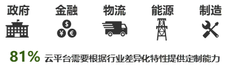
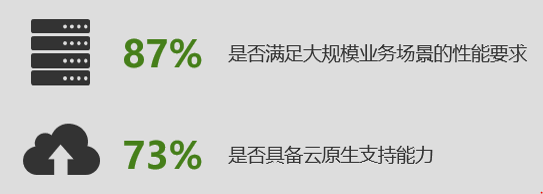

# 传统专有云平台面临的挑战

很多政府和企业已经完成了资源的虚拟化，但在面对企业架构进一步升级和改造时，在建设云平台和混合云的管理和运维方面，不仅面临安全合规与系统稳定性的挑战，还要关注自身的行业特征与个性化需求，并可持续地维持IT平台的先进性。在实际使用中，政府和企业用户会很自然地将专有云的特性和技术指标与公有云进行比较，这给传统专有云建设者带来了巨大的挑战和压力。

## 安全合规与稳定性的挑战日益凸显

专有云从物理环境上保障了应用和数据的安全可控，但在安全层面仍会面临诸多来自内外部的挑战。因此，要达到与公有云同样的安全合规能力，专有云建设团队需要从安全合规治理及保障手段等多个层面上做好准备。此外，确保专有云稳定地支撑大规模业务场景也是平台建设者需要应对的挑战。

**在云环境中，合规及安全治理是亟待解决的问题**

虚拟化扩展了计算、存储、网络等IT资源，既打破了传统的物理隔离又使得管理环境日益复杂。无论是基础设施还是系统架构，都因业务需求的不断变化而存在诸多不确定性因素，给安全管理和运维带来了极大挑战。在调研中，尽管受访者非常认可“专有云平台在物理层面上的安全可控”，特别是在对企业关键数据的保护方面，但是高达93%的受访者依然认为“在部署专有云平台的过程中需要系统性地解决安全合规的问题”（见图5）。

**缺乏完善的云安全保障手段是企业全面云化的障碍**

企业部署云平台面临三个方面的安全挑战：1）安全策略：由虚拟化产生的流量模型的变化和因业务变化带来的虚机迁移，使得企业的安全策略需要动态适应系统和应用带来的变化；2）访问控制：除了现有的企业级云安全方案在应对传统终端漏洞带来的威胁以外，虚拟化环境所产生的跨域访问、多个虚机之间的资源调用和防护等问题仍为薄弱环节；3）数据安全：如果不同保密层级的核心数据资源存储在同一介质内，可能存在不同安全级别跨级访问的风险。受访者认为资源访问控制、入侵检测、拦截和告警以及平台安全监控四个方面是最值得关注的云安全特性。

**企业对专有云平台的综合性能存有顾虑**

很多企业最初采用开源产品创建云平台。受限于开源产品本身的配置和管理等问题，企业在部署和使用专有云过程中存在诸多困扰，84%的受访者不确定专有云是否可以根据业务的变化或不同场景下的业务需求，满足实时的动态负载要求；另外有87%的受访者认为，企业在建设专有云过程中面临的挑战还来自于“是否具有和公有云相当的稳定性和可靠性”（见图5）。

**图 5：受访企业在建设企业专有云过程中面临的主要挑战**

## 差异化的行业需求难以得到满足

不同行业和规模的企业，由于业务系统差异性较大，所以对平台的需求也不尽相同。在调研中，81%的受访者认为云平台需要根据企业自身的行业特征加强定制能力（见图6）。

**通用化的专有云方案有待加强**

当前市场的专有云平台往往过于通用化，缺乏针对具体行业、具体场景的垂直解决方案。举例来说，政府和民生领域非常重视专有云的安全保密性；金融行业除看重数据安全以外，对可靠性以及性能的要求也很高；而制造行业往往要求多种制造设备间的互联互通，以及对仓储物流等垂直应用的支持。同时，为保证合规，企业需按照行业规范和政府要求来建设信息化系统。因此，获得具有行业特性的定制化云架构成为企业或政府机构的迫切需求。

**专有云平台可配置能力有待加强**

企业需要的是包含IT资源云化管理、数据资产化、应用服务化、开发敏捷化在内的端到端服务。传统专有云解决方案往往缺乏可配置能力，需要大量二次开发。对于企业而言，搭建专有云平台是为了简化IT管理，把IT团队从基础事务中解放出来，如果未经周密考察就采用不合适的专有云方案，反而会给后期的平台升级和维护带来技术层面的障碍和难以控制的风险。

**多租户能力较为局限**

很多大型企业的专有云会服务于下属企业或合作伙伴，客观上形成了多租户形态的大型集团企业云。同一行业不同企业集团之间也可共同建设更大规模的行业云。更有甚者，跨企业、跨行业的合作企业可能会针对某类专属应用（如大规模征信）建设专属云平台用于大规模、实时的数据交换——以上场景都需要专有云拥有多租户的抽象能力，以便按照业务需求开发和部署应用。但是当前大多数专有云的多租户概念仅集中在基础设施层，对上层抽象租户的支撑能力有限。

**图 6：通用的云平台难以满足行业差异化需求**

## 平台先进性难以持续

数字技术是数字化转型的关键推动力。根据Forrester的研究，全球范围的企业决策者在制定业务决策时，数字技术是其首要考虑的因素（43%），高于经济及市场走势（31%）、市场颠覆者（12%）以及政治因素（6%）。而在我国，企业对数字技术的关注甚至高达70%，远远领先其他因素。专有云平台被广泛认为应成为先进数字技术的载体，这也为专有云平台建设提出了更高要求。

 **云原生技术带来开发模式的变革**
 
 云原生架构与技术涵盖容器与容器管理、服务网格、函数即服务、API管理、CI/CD（持续集成/持续交付）支持等众多技术领域，并延伸到原有应用改造与项目管理运行方式的重大转变，这意味着专有云建设方将同时面临技术管理与组织管理的多重挑战。在调研中，73%的受访者认为其所在企业或政府机构在建设专有云平台时缺乏云原生技术的支持（见图7）。
 
**新兴技术相互依赖，迭代速度快**

企业的数字化转型旨在推动数字化创新，而数字化创新离不开新兴技术的支持。新兴技术往往互相依存，如物联网和人工智能的深化应用离不开大数据的支持，大数据平台的效率提升又需要机器学习技术的支持。新兴技术迭代快，各种新的组件层出不穷，加大了不同技术间的整合和进一步提供平台服务的难度。
 
**高性能的业务需求考验专有云平台的能力**
 
高并发业务给所有云架构带来了严峻的考验。大型公有云厂商大多经历过高压业务场景的考验，有足够的应对经验和能力。相比之下，传统专有云对于高性能场景的应对能力略显吃力，这对企业以及专有云平台建设和服务提供方而言都相当棘手。在调研中，87%的受访者担心其专有云在应对大规模业务场景时可能会遇到挑战。
 
 **图 7：云平台需要持续保持平台的先进性和功能迭代**
 

