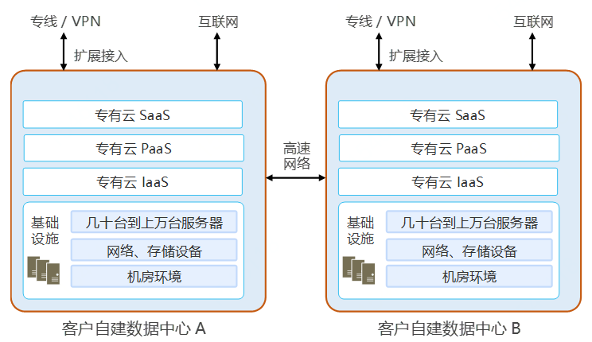

#  专有云解决方案

###                                         

专有云是部署在用户自建数据中心，具有几十台到上万台服务器规模的云计算平台。专有云解决方案是基于省市县等地域政府、大中型企业等行业中大型客户的信息系统需求，利用京东云专有云云计算平台产品，为客户提供全技术栈的一站式解决方案。如上文所述，京东云的专有云产品JDStack具有与京东云公有云相同的架构和稳定性。因此，专有云解决方案能够解决大中型规模客户对云计算平台安全性、稳定性、易维护性、服务质量等全方位的需求。京东云专有云解决方案能够帮助客户实现对某个地域的用户或行业用户赋能，在专有云平台上搭建行业用户需要的SaaS产品，为整个行业用户提供强大的云计算能力，实现专有云客户业务的不断增长。
