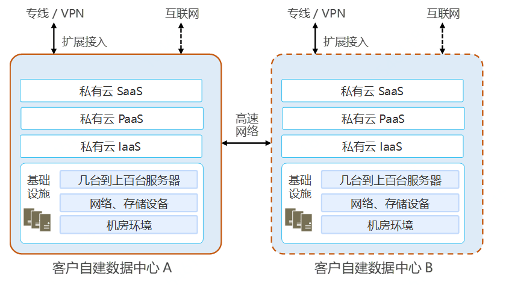

#  私有云解决方案

私有云是部署在客户自建数据中心或机房内，具有几台到上百台服务器规模的云计算平台。私有云解决方案是基于政府、社会组织、企业等不同行业的特有需求，利用京东云私有云云计算平台产品，为客户提供的一站式技术和产品解决方案。私有云解决方案能够解决中小型规模客户对云计算平台的需求，在客户数据中心和机房搭建私有云云计算平台的基础上，通过定制化开发满足客户的个性化需求。私有云解决方案具有灵活性强、安全性高等优点，能够适配客户对不同规模云计算平台的需求，可通过物理隔离和安全增强等方法大幅提升系统安全性。
