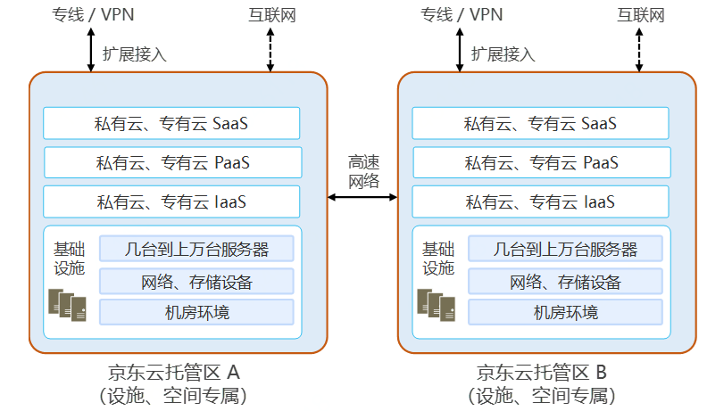

# 专属云解决方案

###                                      

专属云是将上述的私有云或专有云平台产品部署在京东云数据中心内托管区，并与京东云公有云和其它客户的系统进行物理隔离的云计算平台。专属云解决方案为客户同时解决了数据中心建设、系统安全性、系统运维等多个难题。客户可以根据自身需求灵活选择京东云自主研发的私有云云簇X和专有云JDStack等云计算平台产品，也可以选择京东云合作伙伴研发的云计算产品。专属云解决方案能够帮助客户节省大量自建数据中心的成本，还能保证客户系统的安全性。京东云已获得中国信息通信研究院可信云服务认证等多项国家和国际权威安全认证，完全有能力确保客户系统的安全可靠，成为最值得客户信赖的云品牌。

